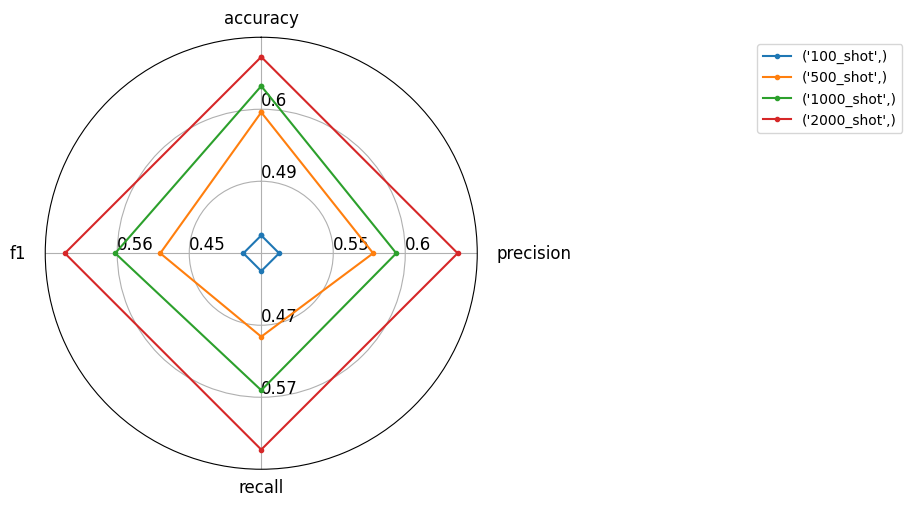

## 实验：Few-shot 微调大模型

在这次实验中，我们分别使用了100、500、1000和2000条数据对大模型进行了微调。我们的目标是评估不同大小的数据集对大模型表现的影响。

### 实验方法

为了高效地完成微调任务，我们使用了Linux shell脚本来自动化这一过程。具体步骤如下：
1. **数据准备**：将不同大小的数据集准备好。
2. **批量微调**：利用Linux shell脚本批量化地微调大模型，自动保存微调后的模型权重。
3. **自动评估**：微调完成后，脚本会自动调用评估程序，对模型在测试集上的表现进行评估。

这种方法极大地提高了工作效率。若不使用自动化脚本，我们需要手动逐个训练模型，然后手动运行评估程序，这不仅耗时，而且容易出错。

### 优势

- **时间节省**：利用自动化脚本，我们可以在夜间让计算机自行完成微调和评估工作，第二天早上起床后即可查看结果。
- **减少人工干预**：整个过程无需过多人工干预，减少了人工的时间与精力。

通过这种方式，我们能够得出不同大小数据集对大模型表现的影响，为进一步的研究提供了宝贵的数据支持。

## 项目文件介绍

* build_llm_data.ipynb
  从训练集中随机筛选并转换为Alpaca样式的数据集格式
  在大模型的微调过程中，从训练集中随机抽取不同规模的数据样本，以便进行模型的测试和优化。本文从训练集中随机筛选100、500、1000和2000条数据，并将这些数据转换为Alpaca样式的微调数据集格式，最后将筛选后的数据保存在data文件夹下。

  下述是转化为大模型微调的数据集样例：

  ```json
  [
    {
      "instruction": "You are a document classifier. When given the text, you classify the text into one of the following categories:\n\n\"Human Necessities\"\n\"Performing Operations; Transporting\"\n\"Chemistry; Metallurgy\"\n\"Textiles; Paper\"\n\"Fixed Constructions\"\n\"Mechanical Engineering; Lightning; Heating; Weapons; Blasting\"\n\"Physics\"\n\"Electricity\"\n\"General tagging of new or cross-sectional technology\"\n\"Unknown\"\n\nYour output should only contain one of the categories and no explanation or any other text.",
      "input": "Classify the document:\nan image sensor device may include a dual - gated charge storage region within a substrate . the dual - gated charge storage region includes first and second diodes within a common charge generating region . this charge generating region is configured to receive light incident on a surface of the image sensor device . the first and second diodes include respective first conductivity type regions responsive to first and second gate signals , respectively . these first and second gate signals are active during non - overlapping time intervals .",
      "output": "Electricity"
    },
    ...
  ]
  ```


* train.sh
在开始训练之前，需要在 `LLaMA-Factory/data/dataset_info.json` 文件中注册 `data` 目录下的数据集。接下来，从 LLaMA-Factory 的可视化界面获取 LoRA 微调的命令行。`train.sh` 脚本实现了批量化训练，并在训练完成后保存 LoRA 的权重。

* eval.sh
在训练完成后，使用 VLLM 部署训练完成的 LoRA 模型，并将其部署成 API 接口，便于通过 `infer_eval.py` 进行评估。`eval.sh` 脚本实现了对训练模型的批量部署与评估，自动化地逐个部署和推理。在评估完成一个大模型后，脚本会杀死正在部署的进程，开始部署下一个大模型，并进行新的评估。

* infer_eval.py
利用在线部署的大模型，结合 LangChain 工具，在测试集上逐个进行评估。

* see_result.ipynb
导入保存到objs文件夹中的预测结果，并进行结果的渲染
最后结果如下图所示：



