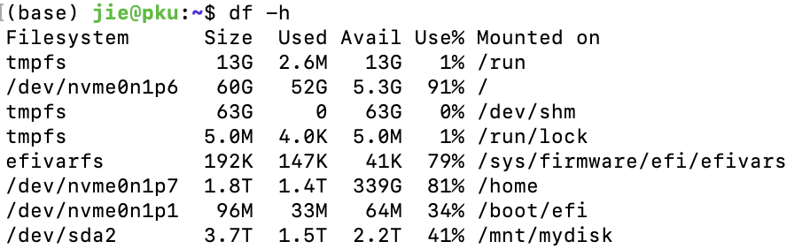

# Linux 开机自动挂载硬盘


在日常使用 Linux 系统的过程中，我们可能需要挂载一些机械硬盘或者移动硬盘来存储数据。手动挂载虽然简单，但每次重启后都需要重新操作，未免有些繁琐。那么，如何让硬盘在开机时自动挂载呢？本篇博客将详细介绍如何通过配置 `/etc/fstab` 文件来实现这一目标。

### 1. 了解硬盘分区信息

首先，我们需要知道硬盘分区的详细信息，比如 UUID、文件系统类型等。这些信息可以通过 `sudo blkid` 命令来查看。

执行以下命令：
```bash
sudo blkid
```

终端会输出很多磁盘信息，从可视化的界面中，根据磁盘信息磁盘有多大空间，可用多少空间就可确定目标硬盘为：`/dev/sda2`。

即可对应找出相应的硬盘信息：

```
/dev/sda2: LABEL="M-fM???M-^MM-7" BLOCK_SIZE="512" UUID="2ED???167D" TYPE="ntfs" PARTLABEL="Basic data partition" PARTUUID="c41de???46ad"
```

从输出结果中，我们可以找到 `/dev/sda2` 的 UUID 为 `2ED???167D`，文件系统类型为 `ntfs`。

### 2. 创建挂载点

为了让系统知道硬盘该挂载到哪里，我们需要为其创建一个挂载点。挂载点是硬盘挂载后的入口，可以是一个空目录。这里我们选择将其挂载到 `/mnt/mydisk`。

执行以下命令来创建挂载点：
```bash
sudo mkdir -p /mnt/mydisk
```

### 3. 编辑 `/etc/fstab` 文件

接下来，我们需要修改 `/etc/fstab` 文件来配置自动挂载。该文件用于管理 Linux 系统的文件系统挂载点，配置得当可以让硬盘在系统启动时自动挂载。

打开 `/etc/fstab` 文件进行编辑：
```bash
sudo nano /etc/fstab
```

在文件末尾添加如下内容：
```
UUID=2ED???167D /mnt/mydisk ntfs defaults 0 2
```

#### 配置字段解析
- **UUID=2ED???167D**：硬盘分区的唯一标识符，用来定位需要挂载的分区。
- **/mnt/mydisk**：挂载点目录，指定硬盘挂载到的文件夹路径。
- **ntfs**：文件系统类型，根据硬盘实际格式填写，例如 `ext4`、`xfs` 或 `ntfs`。
- **defaults**：挂载选项，表示使用默认设置，包括读写权限、自动挂载等。
- **0**：此字段用于备份设置，通常设为 0 表示不需要备份。
- **2**：表示文件系统检查顺序，根分区一般为 1，其他分区为 2。如果不需要检查可设为 0。

### 4. 测试自动挂载配置

修改完 `/etc/fstab` 文件后，可以执行以下命令来测试配置是否正确：
```bash
sudo mount -a
```

如果没有报错，说明自动挂载配置已经生效。


### 5. 重启系统验证

为了确保硬盘在系统启动时自动挂载，可以重启系统进行验证：
```bash
sudo reboot
```

重启后，可以通过以下命令查看挂载状态：
```bash
df -h
```

如果看到 `/mnt/mydisk` 出现在列表中，表示自动挂载配置成功。




如上图所示，`/dev/sda2` 硬盘，已经挂载到 `/mnt/mydisk`。


### 6. 常见问题及解决办法

#### 1. 启动时挂载失败
如果配置 `/etc/fstab` 文件后，系统启动时出现挂载失败的情况，有可能是文件系统类型填写错误，或者设备没有正确识别到。可以尝试使用不同的文件系统类型（如 `auto` 让系统自动检测）来测试。


#### 2. 文件系统无法写入
对于 NTFS 文件系统，可能会遇到权限问题，可以尝试修改 `/etc/fstab` 中的挂载选项：
```
UUID=2ED???167D /mnt/mydisk ntfs defaults,umask=000 0 2
```
`umask=000` 使所有用户对挂载的分区拥有完全的读写权限。

### 总结

通过修改 `/etc/fstab` 文件，让 Linux 系统开机自动挂载硬盘不仅省去了手动挂载的麻烦，还可以确保系统在启动时自动访问硬盘上的数据。希望这篇博客能帮助你顺利完成硬盘的自动挂载配置！s