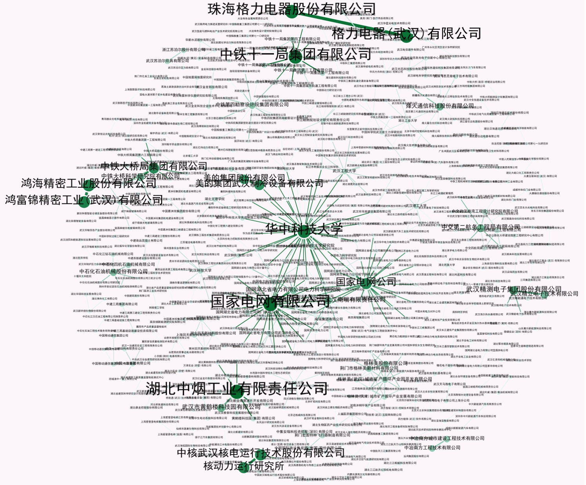
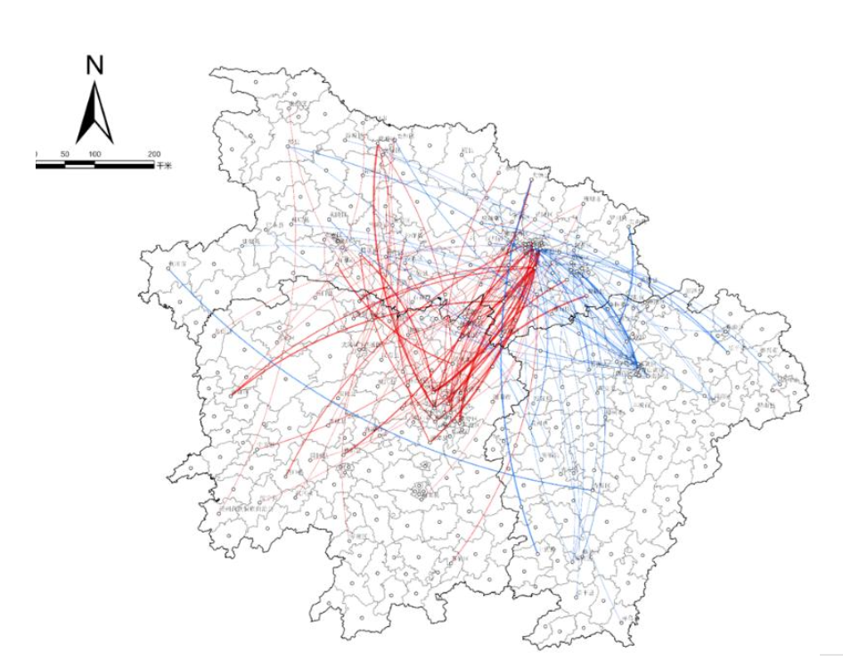

# 专利数据存入Mysql数据库

> 3500多万家专利信息


本文将详细介绍如何利用Python的Pandas库，将3500万家专利信息读取并存入MySQL数据库的过程。

利用 panda 读取表格，使用 `.columns` 即可拿到属性名。再把该属性名输入给 chatgpt 让其快速生成 sql 创建表格的语句。


## 一、使用Pandas读取专利数据

首先，我们可以使用Pandas读取存储专利信息的表格，获取表的属性名。通过`.columns`方法，可以获得这些属性名，并将其用于后续的数据库表创建。

```python
import pandas as pd

# 读取专利数据
data = pd.read_csv('patents.csv')

# 获取属性名
columns = data.columns.tolist()
print(columns)
```

###  二、属性名映射与SQL表创建

接下来，我们将获取的中文属性名映射到相应的英文属性名，并使用ChatGPT生成创建MySQL表的SQL语句。

提示词如下：

```
请你结合下述专利表的属性列。请你首先输出中文属性名到英文属性名的字典对应关系。再生成创建专利表的sql语句：

['专利公开号', '专利名称', '专利类型', '专利摘要', '申请人', '专利申请号', '申请日', '申请公布日',
       '授权公布号', '授权公布日', '申请地址', '主权项', '发明人', '分类号', '主分类号', '代理机构', '分案原申请号',
       '优先权', '国际申请', '国际公布', '代理人', '省份或国家代码', '法律状态', '专利领域', '专利学科',
       '多次公布']
```


以下是ChatGPT生成的中文属性名与英文属性名的对应关系：

```python
column_mapping = {
    '专利公开号': 'publication_number',
    '专利名称': 'patent_name',
    '专利类型': 'patent_type',
    '专利摘要': 'abstract',
    '申请人': 'applicant',
    '专利申请号': 'application_number',
    '申请日': 'application_date',
    '申请公布日': 'publication_date',
    '授权公布号': 'grant_publication_number',
    '授权公布日': 'grant_publication_date',
    '申请地址': 'application_address',
    '主权项': 'claims',
    '发明人': 'inventor',
    '分类号': 'classification_number',
    '主分类号': 'main_classification_number',
    '代理机构': 'agency',
    '分案原申请号': 'original_application_number',
    '优先权': 'priority',
    '国际申请': 'international_application',
    '国际公布': 'international_publication',
    '代理人': 'agent',
    '省份或国家代码': 'province_or_country_code',
    '法律状态': 'legal_status',
    '专利领域': 'patent_field',
    '专利学科': 'patent_subject',
    '多次公布': 'multiple_publications'
}
```

通过将上述映射关系转化为SQL语句，我们可以创建名为`patents`的数据库表。以下是创建表的SQL语句：

```sql
CREATE TABLE patents (
    id INT AUTO_INCREMENT PRIMARY KEY,
    publication_number VARCHAR(31),
    patent_name VARCHAR(255),
    patent_type VARCHAR(31),
    abstract TEXT,
    applicant VARCHAR(255),
    application_number VARCHAR(31),
    application_date DATE,
    publication_date DATE,
    grant_publication_number VARCHAR(31),
    grant_publication_date DATE,
    application_address VARCHAR(255),
    claims MEDIUMTEXT,
    inventor VARCHAR(1024),
    classification_number VARCHAR(1024),
    main_classification_number VARCHAR(127),
    agency VARCHAR(255),
    original_application_number VARCHAR(255),
    priority VARCHAR(512),
    international_application VARCHAR(255),
    international_publication VARCHAR(255),
    agent VARCHAR(255),
    province_or_country_code INT,
    legal_status TEXT,
    patent_field VARCHAR(255),
    patent_subject VARCHAR(255),
    multiple_publications VARCHAR(63),
    province VARCHAR(32)
);
```


建表代码：

```python
import os
import pymysql
import pandas as pd
from tqdm import tqdm

# 初始化 database, password

column_mapping = {
    '专利公开号': 'publication_number',
    '专利名称': 'patent_name',
    '专利类型': 'patent_type',
    '专利摘要': 'abstract',
    '申请人': 'applicant', # 多个人
    '专利申请号': 'application_number',
    '申请日': 'application_date',
    '申请公布日': 'publication_date',
    '授权公布号': 'grant_publication_number',
    '授权公布日': 'grant_publication_date',
    '申请地址': 'application_address',
    '主权项': 'claims',
    '发明人': 'inventor',
    '分类号': 'classification_number',
    '主分类号': 'main_classification_number',
    '代理机构': 'agency',
    '分案原申请号': 'original_application_number',
    '优先权': 'priority',
    '国际申请': 'international_application',
    '国际公布': 'international_publication',
    '代理人': 'agent',
    '省份或国家代码': 'province_or_country_code',
    '法律状态': 'legal_status',
    '专利领域': 'patent_field',
    '专利学科': 'patent_subject',
    '多次公布': 'multiple_publications'
}


def trans2int(item):
    if pd.isna(item):
        return None
    try:
        return int(eval(item))
    except:
        return None


def parse_item(row, attr_name, args: list):
    
    assert isinstance(args, list)

    # 字符截断
    trunc_item = {
        "applicant" : 255,
        "application_address": 255,
        "inventor": 1024,
        "classification_number": 1024,
        "main_classification_number": 127,
        "agency" : 255,
        "original_application_number": 127,
        "priority" : 511,
        "international_application": 255,
        "international_publication": 255,
        "agent": 127,
        "patent_field" : 255,
        "patent_subject" : 255,
        "multiple_publications": 63,
    }

    ans = []
    for attr in attr_name:
        en_attr = column_mapping[attr]
        item = row.get(attr, None)
        
        if pd.isna(item):
            ans.append(None)
            continue
        
        if en_attr == "province_or_country_code":
            item = trans2int(item)
        # 异常字符捕获
        elif isinstance(item, str):
            item = item.strip()
            # 有 空串 和 -
            if len(item) in [0, 1]:
                item = None
        
        if en_attr in trunc_item.keys():
            if isinstance(item, str):
                item = item[:trunc_item[en_attr]]
                
        ans.append(item)
    ans += args
    
    return tuple(ans)


def insert_sql_by_csv(file):
    df = pd.read_csv(file, low_memory=False)
    
    province = os.path.basename(file).split('.')[0]
    # 连接到MySQL数据库
    connection = pymysql.connect(
        host="localhost",  # MySQL数据库的主机
        user="root",  # MySQL用户名
        password=password,  # MySQL密码
        database=database,  # 你要插入数据的数据库
        charset="utf8mb4",
        cursorclass=pymysql.cursors.DictCursor,
    )
    
    BATCH_SIZE = 1000

    tmp_list = list(column_mapping.values()) + ["province"]
    sql = f"""
            INSERT INTO patents (
                {", ".join(tmp_list)}
            ) VALUES (
                {', '.join(['%s'] * len(tmp_list))}
            );
            """.strip()
    
    # 插入数据到MySQL
    try:
        with connection.cursor() as cursor:
            batch = []
            for _, row in tqdm(df.iterrows(), total=len(df)):
    
                batch.append(
                        parse_item(row, list(column_mapping.keys()), [province])
                    )

                # 当批次达到 BATCH_SIZE 时执行批量插入
                if len(batch) >= BATCH_SIZE:
                    cursor.executemany(sql, batch)
                    batch = []  # 清空批次
                    
            # 插入剩余的未满批次的数据
            if batch:
                cursor.executemany(sql, batch)

            # 提交事务
            connection.commit()
            
    except Exception as e:
        print(f"插入数据时出现错误: {e}")
        connection.rollback()

    finally:
        connection.close()


if __name__ == "__main__":    
    folder = "/media/jie/新加卷/pku_data/3571万专利申请全量数据1985-2022年/"
    print(f"文件总数: {len(os.listdir(folder))}")
    cnt = 0
    for file_name in os.listdir(folder):
        if file_name.endswith(".csv"):
            cnt += 1
            filename = os.path.join(folder, file_name)
            print(cnt, file_name)
            insert_sql_by_csv(filename)

    print("所有数据全部插入完成！")

    # mysql -h 127.0.0.1 -P 3306 -u root -p
    # nohup python build_patent_table.py > build_patent_table.log 2>&1 &
```


## 任务

专利申请人的表

* 想统计每家公司有多少专利？这家公司每年有多少专利？

  可以设计表结构如下：

  属性列为 [id, 专利申请人, 专利公开号,  得分，专利年份等]

  * 专利申请人只要公司，个人就不要了，length > 4

  * 专利公开号：专利的唯一标识符，可以考虑是否设置成外键约束。

  * 位置，$\frac{1}{申请人中的顺序}$

    如果是第一，那就是1。第二就是 $\frac{1}{2}$
    
    

* 哪些公司之间有合作关系？（就可以做**企业之间的协同分析**，专利的共同申请者）

  > 这个表结构还没想好，后面再看！
  
  
  
  |      | 公司1                            | 公司2                    | 公司1_经度 | 公司1_纬度 | 公司2_经度 | 公司2_纬度 | 次数 |
  | ---- | -------------------------------- | ------------------------ | ---------- | ---------- | ---------- | ---------- | ---- |
  | 0    | 格力电器(武汉)有限公司           | 珠海格力电器股份有限公司 |            |            |            |            | 1419 |
  | 1    | 鸿富锦精密工业(武汉)有限公司     | 鸿海精密工业股份有限公司 |            |            |            |            | 1193 |
  | 2    | 中核武汉核电运行技术股份有限公司 | 核动力运行研究所         |            |            |            |            | 1043 |
  
  
  
  


## 三、创建专利申请人 patent_person 表


```
再创建一个patent_person 表，属性列为 [id, 专利申请人, 专利公开号, 位置，专利年份], 专利公开号与patents表中的publication_number 对应。请你给出对应sql建表语句。
```

示例：


如何插入数据：

```sql
INSERT INTO patent_person (applicant, publication_number) 
VALUES ('张三', 'CN123456789A');
```


应用场景
