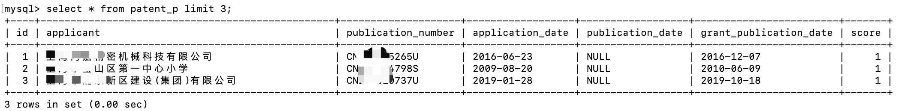
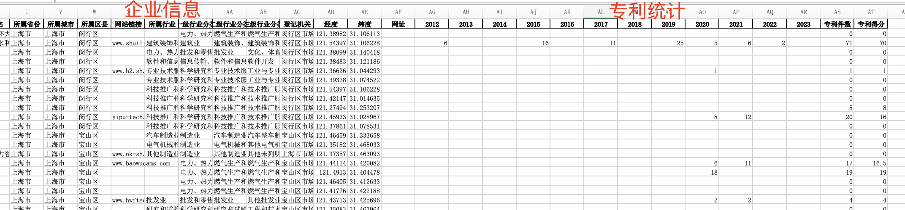
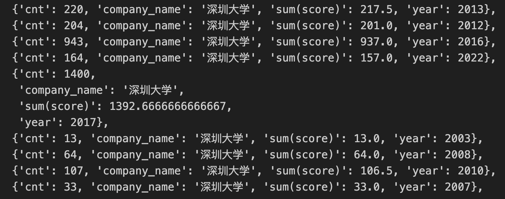

## 背景
最近在做产业链/产业评估，其中有一个专利评估指标。需要统计出企业每一年的专利数。
本文使用Mysql数据库，实现依据公司名实现查询出该公司每一年的专利，因为数据库的查询速度很快。

## 流程


在文章开头简单的介绍一下本项目的流程。

【目标】：根据给定的企业名单，查询出该企业每一年的专利数和专利得分。

该任务分成两步走：
1. 构建专利申请人数据表；
2. python 查出数据输出excel表；

【难点注意⚠️】：

* 设计专利申请人表，高效地根据申请人名字查询到专利。

* 编写企业专利SQL查询语言。

* 专利得分：某件专利可能会有多个申请人。根据专利申请人的顺序定制不同的得分。
  $$
  \text{专利申请人顺序: } position \\
  \text{专利得分: } score = \frac{1}{position}
  $$


## 构建专利申请人数据表

把完整的专利表插入到数据库的操作参见：[3500多万家专利数据存入Mysql数据库](https://blog.csdn.net/sjxgghg/article/details/143304970)

原始的专利表格的申请人属性中，有**多位申请人**的信息。由于专利总数有3000多万条，直接查看申请人是否包含目标申请人，这个速度会非常慢。

数据表的效果如下所示：



为了加快企业专利的查询速度，建一个`专利申请人`的表，取名为 `patent_p`。该表的属性如下：
```python
Patent_Table_Column = {
    "申请人": "applicant",
    "专利公开号": "publication_number",
    "申请日": "application_date",
    "申请公布日": "publication_date",
    "授权公布日": "grant_publication_date",
}
```

* 专利公开号：专利的唯一标识符，用来连接到`专利表`。方便在后续与专利表连接。
* 申请人：原始的专利表，申请人有多位。在`专利申请人`表中，申请人只是一位，便于后续对申请人属性添加索引，加快申请人专利的查找。【添加索引】
* 申请日，申请公布日，授权公布日是为了实现根据年份筛选专利。

> 解释：
> 原始表格的申请人有多位人，不便于数据库的快速查找。
> 在构建的`专利申请人`表中，拆分出多条数据，每个申请人都是一条数据。再对**申请人添加索引**，可以很快的根据申请人的名字找出其所有的专利。

使用以下SQL语句为 `applicant` 列添加索引：

```sql
CREATE INDEX idx_applicant ON patent_p(applicant);
```

这条语句会在 `patent_p` 表的 `applicant` 列上创建一个索引 `idx_applicant`，从而提高在该列上进行查询的效率。

`filter_company`: 从多个申请人中，拆分成一个一个的申请人。

建表的sql语句：

```sql
CREATE TABLE patent_p (
    id INT AUTO_INCREMENT PRIMARY KEY,
    applicant VARCHAR(255),
    publication_number VARCHAR(31),
    application_date DATE,
    publication_date DATE,
    grant_publication_date DATE,
    score DOUBLE
);
```

`专利申请人表`，建表的代码如下所示：

```python
import os
import re
import pymysql
import pandas as pd
from tqdm import tqdm

PASSWORD = "数据库密码"
DATABASE = "数据库名"

# 专利字段映射
Patent_Table_Column = {
    "申请人": "applicant",
    "专利公开号": "publication_number",
    "申请日": "application_date",
    "申请公布日": "publication_date",
    "授权公布日": "grant_publication_date",
}


def filter_company(applicant):
    """
    提取中文公司名称，并去除空格
    """
    if applicant is None or not isinstance(applicant, str):
        return []

    split_pattern = r"[;；]"
    applicant = re.split(split_pattern, applicant)
    applicant = map(str.strip, applicant)
    return list(filter(lambda x: len(x) >= 4, applicant))


def insert_sql_by_csv(file_name):
    df = pd.read_csv(file_name, low_memory=False)
    BATCH_SIZE = 3000
    table_column_en = list(Patent_Table_Column.values())

    # 连接到MySQL数据库
    connection = pymysql.connect(
        host="localhost",  # MySQL数据库的主机
        user="root",  # MySQL用户名
        password=PASSWORD,  # MySQL密码
        database=DATABASE,  # 你要插入数据的数据库
        charset="utf8mb4",
        cursorclass=pymysql.cursors.DictCursor,
    )

    try:
        with connection.cursor() as cursor:
            sql = f"""
                    INSERT INTO patent_p ({", ".join(table_column_en)}, score) 
                    VALUES (%s, %s, %s, %s, %s, %s);
                    """.strip()
            batch_data = []

            for _, row in tqdm(df.iterrows(), total=len(df)):
                d = {}
                applicants = []

                for zh_k, en_k in Patent_Table_Column.items():
                    item = row[zh_k]
                    if pd.isna(item):
                        item = None

                    if zh_k == "申请人":
                        applicants = filter_company(item)
                    else:
                        d[en_k] = item

                for pos, applicant in enumerate(applicants):
                    d["applicant"] = applicant
                    d["score"] = 1 / (pos + 1)

                    tmp_values = tuple([d[k] for k in table_column_en + ["score"]])
                    batch_data.append(tmp_values)
                    if len(batch_data) >= BATCH_SIZE:
                        cursor.executemany(sql, batch_data)
                        # 清空批次
                        batch_data = []

            if batch_data:
                cursor.executemany(sql, batch_data)
            connection.commit()

    except Exception as e:
        print(f"插入数据时出现错误: {e}")
        connection.rollback()
    finally:
        connection.close()


if __name__ == "__main__":

    folder = "/xxx/3571万专利申请全量数据1985-2022年/"
    print(f"文件总数: {len(os.listdir(folder))}")
    cnt = 0
    for file_name in os.listdir(folder):
        if file_name.endswith(".csv"):
            cnt += 1
            filename = os.path.join(folder, file_name)
            print(cnt, file_name)
            insert_sql_by_csv(filename)
```


## 企业专利查询

在前面的文章中，已经构建过了企业信息数据库的表。
在原来的数据属性列后面，添加该公司的专利统计数据：2016, 2017, 2018, ..., 2022,专利件数,专利得分。
最终实现的效果如下所示：



```sql
select applicant as company_name, YEAR(application_date) as year, count(*) as cnt, sum(score) from patent_p 
where applicant='深圳大学'
group by YEAR(application_date);
```

运行效果如下所示：



上述 MySQL 代码查询特定公司的专利信息，具体作用如下：

1. **select 子句**： 
   - `applicant as company_name`：将 `applicant` 列重命名为 `company_name`，表示公司的名称。
   - `YEAR(application_date) as year`：提取 `application_date` 列的年份，并将其命名为 `year`。
   - `count(*) as cnt`：计算每年提交的专利申请数量。
   - `sum(score)`：计算该公司每年所有专利申请的 `score` 总和。

2. **from 子句**：从 `patent_p` 表中获取数据。

3. **where 子句**：筛选出 `applicant` 字段值等于 `{name}` 的记录，即指定公司名称。

4. **group by 子句**：根据 `YEAR(application_date)` 对结果分组，即按年份统计数据。

### 查询结果
该查询会返回指定公司在每一年的专利申请总数 (`cnt`) 和该年度的分数总和 (`sum(score)`)。`query_patent_cnt_score.py`

```python
import os
import pandas as pd
import pymysql
# import argparse

database = "数据库名"
password = "数据库密码"


connection = pymysql.connect(
    host="localhost",  # MySQL数据库的主机
    user="root",       # MySQL用户名
    password=password, # MySQL密码
    database=database, # 插入数据的数据库
    charset="utf8mb4",
    cursorclass=pymysql.cursors.DictCursor,
)

columns = list(range(1985, 2024)) + ["专利件数", "专利得分"]


def get_patent_statistics_by_name(name):
    if not name:
        return {}

    sql = f"""select applicant as company_name, YEAR(application_date) as year, count(*) as cnt, sum(score) from patent_p 
    where applicant='{name}'
    group by YEAR(application_date);
    """
    with connection.cursor() as cursor:
        data = cursor.execute(sql)
        data = cursor.fetchall()

    ans = {}
    cnt = 0
    score = 0

    for k in columns:
        ans[k] = None

    for item in data:
        cnt += item.get("cnt", 0)
        score += item.get("sum(score)", 0)

        year = item.get("year", None)
        if year:
            ans[year] = item.get("cnt", 0)

    ans["专利得分"] = score
    ans["专利件数"] = cnt
    return pd.Series(ans)


def add_patent_data(input_file, company_name_field="企业名称"):

    print("open", input_file)
    # 读取 CSV 文件
    df = pd.read_csv(input_file, low_memory=False)
    
    df[columns] = df[company_name_field].apply(get_patent_statistics_by_name)

    folder_path = os.path.dirname(input_file)
    output_file = os.path.basename(input_file).split(".")[0] + "_专利统计.xlsx"
    # 保存更新后的数据到 CSV 文件
    output_file = os.path.join(folder_path, output_file)
    
    df.to_excel(output_file, index=False)
    print(f"专利数据已成功添加到文件：{output_file}")


if __name__ == "__main__":
    
    # parser = argparse.ArgumentParser(description="Add patent counts to industry.csv")
    # parser.add_argument("input_file", help="The input CSV file with industry data")
    # parser.add_argument(
    #     "-name", "--name", default="企业名称", help="The column name for company names"
    # )
    # args = parser.parse_args()

    # # 调用函数处理文件
    # add_patent_data(args.input_file, args.name)
    
    folder = "/.../pku_industry/csv_folder_test"
    for file in os.listdir(folder):
        if not file.endswith(".csv"):
            continue
        file_name = os.path.join(folder, file)
        add_patent_data(file_name)

    connection.close()
```


## 背景
在进行产业链/产业评估工作时，我们需要对企业的专利进行评估，其中一个重要指标是统计企业每一年的专利数量。本文基于MySQL数据库，通过公司名称查询该公司每年的专利数，实现了高效的专利数据统计。

## 流程


项目流程概述如下：

**目标**：根据给定的企业名单，查询出每个企业每年的专利数量及专利得分。

任务分为两步：
1. 构建专利申请人数据表；
2. 利用Python查询并导出数据至Excel表。

**难点与注意事项⚠️**：

* 设计高效的专利申请人数据表，以便通过申请人名称快速查询专利信息。
* 编写高效的企业专利SQL查询语句。
* 确定专利得分：考虑到一项专利可能有多个申请人，根据申请人的位置来定义不同的得分公式。
  $$
  \text{专利得分公式: } score = \frac{1}{position}
  $$

## 构建专利申请人数据表

具体数据导入操作请参考：[3500多万家专利数据存入MySQL数据库](https://blog.csdn.net/sjxgghg/article/details/143304970)。

由于专利数据包含超过3000万条记录，且每项专利可能有多位申请人，直接检索是否包含目标申请人效率较低。因此，我们构建了一个`专利申请人`表（`patent_p`），将每个申请人作为单独的记录，并对申请人字段建立索引，便于快速查询。表结构如下：

```sql
CREATE TABLE patent_p (
    id INT AUTO_INCREMENT PRIMARY KEY,
    applicant VARCHAR(255),
    publication_number VARCHAR(31),
    application_date DATE,
    publication_date DATE,
    grant_publication_date DATE,
    score DOUBLE
);
```

**字段说明**：
- **专利公开号**：作为专利的唯一标识符，便于关联主专利表。
- **申请人**：每条记录仅包含一个申请人，以便在此字段上建立索引，加速检索。
- **日期字段**：用于按照年份筛选专利数据。

> **注意**：原始专利表中的申请人可能有多位，故在`专利申请人`表中将每个申请人独立存储，再对申请人字段建立索引，从而大幅提升检索效率。

处理申请人拆分的代码如下所示：

```python
def filter_company(applicant):
    """
    提取公司名称，去除空格
    """
    if applicant is None or not isinstance(applicant, str):
        return []
    split_pattern = r"[;；]"
    applicant = re.split(split_pattern, applicant)
    applicant = map(str.strip, applicant)
    return list(filter(lambda x: len(x) >= 4, applicant))
```

具体建表和数据导入的代码：

```python
import os
import re
import pymysql
import pandas as pd
from tqdm import tqdm

PASSWORD = "数据库密码"
DATABASE = "数据库名"

# 专利字段映射
Patent_Table_Column = {
    "申请人": "applicant",
    "专利公开号": "publication_number",
    "申请日": "application_date",
    "申请公布日": "publication_date",
    "授权公布日": "grant_publication_date",
}


def filter_company(applicant):
    """
    提取中文公司名称，并去除空格
    """
    if applicant is None or not isinstance(applicant, str):
        return []

    split_pattern = r"[;；]"
    applicant = re.split(split_pattern, applicant)
    applicant = map(str.strip, applicant)
    return list(filter(lambda x: len(x) >= 4, applicant))


def insert_sql_by_csv(file_name):
    df = pd.read_csv(file_name, low_memory=False)
    BATCH_SIZE = 3000
    table_column_en = list(Patent_Table_Column.values())

    # 连接到MySQL数据库
    connection = pymysql.connect(
        host="localhost",  # MySQL数据库的主机
        user="root",  # MySQL用户名
        password=PASSWORD,  # MySQL密码
        database=DATABASE,  # 你要插入数据的数据库
        charset="utf8mb4",
        cursorclass=pymysql.cursors.DictCursor,
    )

    try:
        with connection.cursor() as cursor:
            sql = f"""
                    INSERT INTO patent_p ({", ".join(table_column_en)}, score) 
                    VALUES (%s, %s, %s, %s, %s, %s);
                    """.strip()
            batch_data = []

            for _, row in tqdm(df.iterrows(), total=len(df)):
                d = {}
                applicants = []

                for zh_k, en_k in Patent_Table_Column.items():
                    item = row[zh_k]
                    if pd.isna(item):
                        item = None

                    if zh_k == "申请人":
                        applicants = filter_company(item)
                    else:
                        d[en_k] = item

                for pos, applicant in enumerate(applicants):
                    d["applicant"] = applicant
                    d["score"] = 1 / (pos + 1)

                    tmp_values = tuple([d[k] for k in table_column_en + ["score"]])
                    batch_data.append(tmp_values)
                    if len(batch_data) >= BATCH_SIZE:
                        cursor.executemany(sql, batch_data)
                        # 清空批次
                        batch_data = []

            if batch_data:
                cursor.executemany(sql, batch_data)
            connection.commit()

    except Exception as e:
        print(f"插入数据时出现错误: {e}")
        connection.rollback()
    finally:
        connection.close()


if __name__ == "__main__":

    folder = "/xxx/3571万专利申请全量数据1985-2022年/"
    print(f"文件总数: {len(os.listdir(folder))}")
    cnt = 0
    for file_name in os.listdir(folder):
        if file_name.endswith(".csv"):
            cnt += 1
            filename = os.path.join(folder, file_name)
            print(cnt, file_name)
            insert_sql_by_csv(filename)
```

## 企业专利查询

在构建完企业信息数据库后，我们添加了公司的年度专利统计数据（2016年至2022年各年专利数量及总得分）。最终查询效果如下：


示例SQL查询语句：

```sql
SELECT applicant AS company_name, YEAR(application_date) AS year, COUNT(*) AS cnt, SUM(score) 
FROM patent_p 
WHERE applicant='深圳大学' 
GROUP BY YEAR(application_date);
```

### 查询结果解释

该查询语句的作用如下：

1. **select 子句**：
   - `applicant as company_name`：将`applicant`列重命名为`company_name`，表示公司名称。
   - `YEAR(application_date) as year`：提取`application_date`的年份，并将其命名为`year`。
   - `count(*) as cnt`：计算每年提交的专利申请数量。
   - `sum(score)`：计算该公司每年所有专利申请的得分总和。

2. **from 子句**：从`patent_p`表中获取数据。

3. **where 子句**：筛选出`applicant`字段值等于指定公司名称的记录。

4. **group by 子句**：按`application_date`的年份分组，统计每年的数据。

该查询将返回指定公司每年专利申请数量（`cnt`）及年度专利得分（`sum(score)`）。具体Python代码实现如下：

```python
import os
import pandas as pd
import pymysql
# import argparse

database = "数据库名"
password = "数据库密码"


connection = pymysql.connect(
    host="localhost",  # MySQL数据库的主机
    user="root",       # MySQL用户名
    password=password, # MySQL密码
    database=database, # 插入数据的数据库
    charset="utf8mb4",
    cursorclass=pymysql.cursors.DictCursor,
)

columns = list(range(1985, 2024)) + ["专利件数", "专利得分"]


def get_patent_statistics_by_name(name):
    if not name:
        return {}

    sql = f"""select applicant as company_name, YEAR(application_date) as year, count(*) as cnt, sum(score) from patent_p 
    where applicant='{name}'
    group by YEAR(application_date);
    """
    with connection.cursor() as cursor:
        data = cursor.execute(sql)
        data = cursor.fetchall()

    ans = {}
    cnt = 0
    score = 0

    for k in columns:
        ans[k] = None

    for item in data:
        cnt += item.get("cnt", 0)
        score += item.get("sum(score)", 0)

        year = item.get("year", None)
        if year:
            ans[year] = item.get("cnt", 0)

    ans["专利得分"] = score
    ans["专利件数"] = cnt
    return pd.Series(ans)


def add_patent_data(input_file, company_name_field="企业名称"):

    print("open", input_file)
    # 读取 CSV 文件
    df = pd.read_csv(input_file, low_memory=False)
    
    df[columns] = df[company_name_field].apply(get_patent_statistics_by_name)

    folder_path = os.path.dirname(input_file)
    output_file = os.path.basename(input_file).split(".")[0] + "_专利统计.xlsx"
    # 保存更新后的数据到 CSV 文件
    output_file = os.path.join(folder_path, output_file)
    
    df.to_excel(output_file, index=False)
    print(f"专利数据已成功添加到文件：{output_file}")


if __name__ == "__main__":
    
    # parser = argparse.ArgumentParser(description="Add patent counts to industry.csv")
    # parser.add_argument("input_file", help="The input CSV file with industry data")
    # parser.add_argument(
    #     "-name", "--name", default="企业名称", help="The column name for company names"
    # )
    # args = parser.parse_args()

    # # 调用函数处理文件
    # add_patent_data(args.input_file, args.name)
    
    folder = "/.../pku_industry/csv_folder_test"
    for file in os.listdir(folder):
        if not file.endswith(".csv"):
            continue
        file_name = os.path.join(folder, file)
        add_patent_data(file_name)

    connection.close()
```

---

经过优化的代码和查询流程，能够大幅提升企业专利信息的检索速度，为产业链分析提供强大的数据支持。
