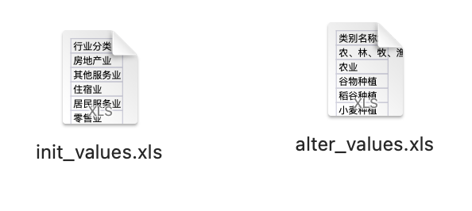
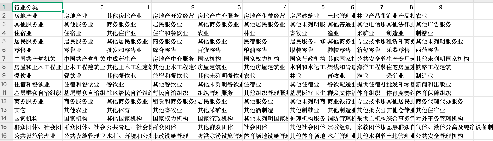
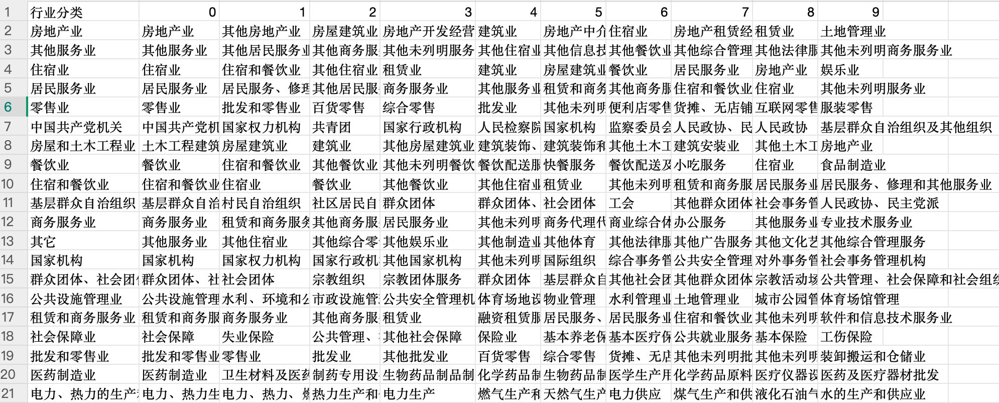
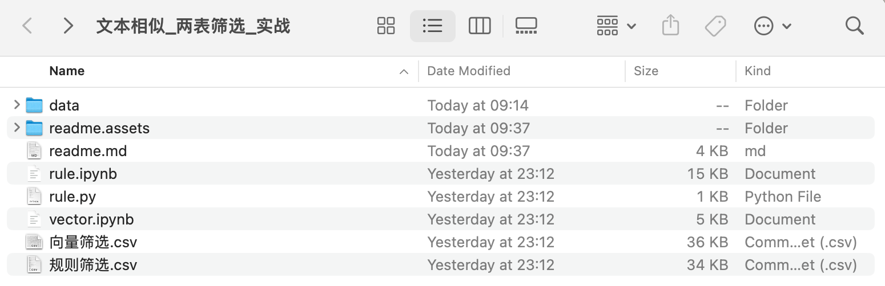

# 企业表相似类别筛选实战

## 项目背景

在当下RAG（检索增强生成）技术应用不断发展的背景下，掌握文本相似算法不仅能够助力信息检索，还可用于评估生成式LLM的效果。

## 介绍
文本分类是现实生活中常见的任务之一。在企业分类中，类别数量通常达到数百个，为了方便理清这些类别间的关系、筛选出相似类别变得尤为重要。本项目旨在解决这一需求。

## 效果展示

本文通过**基于规则的`google_bleu`方法**和**基于向量的相似度计算**，对企业类别间的相似度进行测算，并展示了两种方法的筛选结果。

候选集的表格为 `alter_values.xls`，通过遍历 `init_values.xls` 中的条目，从候选集中筛选出前 TopK 个最相似的条目。

### 基于规则的效果

规则方法主要基于字符层面的相似度计算，使用 `google_bleu` 算法完成，效果如下图所示：

行业分类属性列 来自 `init_values.xls`。

【0-9】属性列，代表与行业分类属性列中值相似的前 Top 10 个值，相似程度从高到低递减，0 属性列为最相似。

由`google_bleu` 支持字符串的相似得分计算，主要是基于字符层面的。

可以改进的点：在分词的时候，采用字分词，每个单字为一个词。在分词时，可通过引入 **jieba分词** 和自定义领域词典进行优化。

### 基于向量相似的效果

向量相似方法采用嵌入模型，能够抓取文本的深层语义信息，避免仅局限于字符表面匹配。

使用 ` jina-embeddings-v2-base-zh ` 作为嵌入模型，点击查看该模型的介绍 https://modelscope.cn/models/jinaai/jina-embeddings-v2-base-zh

使用基于向量的相似度计算，能够把握住文本深层次的语义信息，不会仅仅是表面的字符。

相比规则算法，向量方法能有效筛选出语义相近的类别，例如：

- **规则方法**可能错误地将“房地产中介服务”筛选为与“中 国 共 产 党 机 关”相关的条目；
- **向量方法**则能准确找到更贴合语义的结果，如“国家权力机构”或“共青团”。

**基于规则**：
| 行业分类       | 0              | 1              | 2              | 3              | 4              | 5                          | 6              | 7                | 8                  | 9                  |      |
| -------------- | -------------- | -------------- | -------------- | -------------- | -------------- | -------------------------- | -------------- | ---------------- | ------------------ | ------------------ | ---- |
| 中国共产党机关 | 中国共产党机关 | 中成药生产     | 房地产中介服务 | 国家机构       | 国家权力机构   | 国家行政机构               | 其他国家机构   | 公共安全管理机构 | 生产专用起重机制造 | 其他未列明国家机构 |      |

**基于向量**：

| 行业分类         | 0              | 1                          | 2              | 3                | 4                          | 5                | 6                                | 7                        | 8                    | 9                          |      |
| ---------------- | -------------- | -------------------------- | -------------- | ---------------- | -------------------------- | ---------------- | -------------------------------- | ------------------------ | -------------------- | -------------------------- | ---- |
| 中国共产党机关   | 中国共产党机关 | 国家权力机构               | 共青团         | 国家行政机构     | 人民检察院                 | 国家机构         | 监察委员会、人民法院和人民检察院 | 人民政协、民主党派       | 人民政协             | 基层群众自治组织及其他组织 |      |

可以发现基于规则找出的与`中 国 共 产 党 机 关`相关条目，其中居然包含有`中成药生产`、`房地产中介服务` 。

## 说明

`data`: 存放原始数据目录；

`rule.py`: 基于规则的相似度筛选代码；

`vector.py`: 基于向量的相似度筛选代码；参考 [chroma. https://python.langchain.com/docs/integrations/vectorstores/chroma/](https://python.langchain.com/docs/integrations/vectorstores/chroma/)

`向量筛选.csv` 与 `规则筛选.csv` 是最终的输出结果；

* 代码复用：通过对两个表格与表头的替换，即可实现代码复用；

## 相关文章推荐

[三种文本相似计算方法：规则、向量与大模型裁判.https://blog.csdn.net/sjxgghg/article/details/145209050](https://blog.csdn.net/sjxgghg/article/details/145209050?spm=1001.2014.3001.5501)

百度网盘链接: https://pan.baidu.com/s/1nupbLkGGAn8Uo2ugIWdI1g?pwd=8w7g 提取码: 8w7g 
