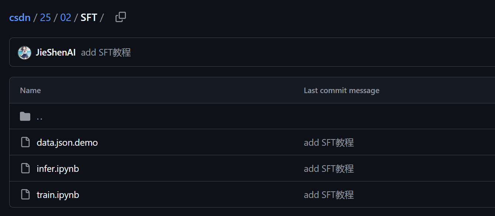
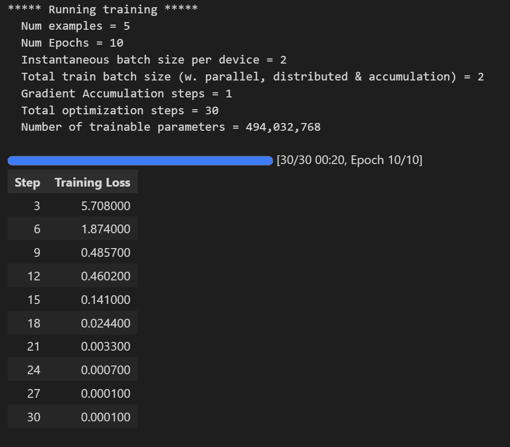

# 大模型有监督微调教程

前一篇文章，介绍了大模型预训练的过程。有监督微调与预训练的代码流程基本一致，唯一的区别就是不对用户输入部分计算loss。
相比前一篇大模型预训练的文章，本篇主要介绍如何把指令部分对应的label设置为-100。

## 开源

开源地址：[https://github.com/JieShenAI/csdn/tree/main/25/02/SFT](https://github.com/JieShenAI/csdn/tree/main/25/02/SFT)



`train.ipynb`：模型有监督微调的代码
`infer.ipynb`: 模型训练完成后，进行推理的代码\

```json
 {
     'instruct': '请你给敖丙写一首诗：', 
     'input': '碧海生龙子，云中舞雪霜。', 
     'label': '恩仇难两忘，何处是家乡？'
 }
```

### 预训练与有监督微调对比


两者的训练数据，大部分都一模一样，维度在 label 部分，SFT 需要把指令部分的 label 设置为-100。

```python
import json
from typing import List, Dict, Sequence
import torch
from torch.nn.utils.rnn import pad_sequence
import transformers
from transformers import TrainingArguments, Trainer, AutoModelForCausalLM, AutoTokenizer
from torch.utils.data import Dataset
from dataclasses import dataclass

IGNORE_INDEX = -100
device = "cuda:0" if torch.cuda.is_available() else "cpu"
model_dir = r"Qwen/Qwen2.5-0.5B"

model = AutoModelForCausalLM.from_pretrained(model_dir)
model = model.to("cuda:0")

tokenizer = AutoTokenizer.from_pretrained(model_dir, padding_side="right")

tokenizer.add_special_tokens({
    "pad_token": "[PAD]"
})

# 数据加载
with open("data.json.demo", "r") as f:
    data = json.load(f)
```


## 自定义数据集

```python
class PreTrainDataset(Dataset):

    def __init__(self, data: List):
        super().__init__()
        self.data = data

    def __len__(self):
        return len(self.data)

    def __getitem__(self, idx) -> List[Dict]:
        item = self.data[idx]
        text = item["instruct"] + item["input"] + item["label"] + tokenizer.eos_token
        text_token = tokenizer(
            text,
            return_tensors="pt",
            padding="longest",
            max_length=tokenizer.model_max_length,
            truncation=True,
        )
        label = text_token["input_ids"].clone()

        instruct = item["instruct"] + item["input"]
        instruct_token = tokenizer(
            instruct,
            return_tensors="pt",
            padding="longest",
            max_length=tokenizer.model_max_length,
            truncation=True,
        )
        instruct_len = instruct_token["input_ids"].size(-1)

        label[:, :instruct_len] = -100
        text_token["labels"] = label
        return text_token


dataset = PreTrainDataset(data)
dataset[0]
```

因为 tokenizer 对文本进行encode的时候，并不是一个词一个token，会出现多个词对应一个token的情况。为了确定指令部分的token长度，单独对指令部分的文本计算一次的encode。然后使用切片 `label[:, :instruct_len] = -100` 把指令部分的 label 设置为 -100 不计算 loss。

查看第一个数据:

```python
# 查看第一个原始数据
data[0]
```

输出：

```python
{'instruct': '请你给哪吒写一首诗：',
 'input': '哪吒降世，意气飞扬。\n逆天改命，破障冲霄。',
 'label': '红绫缠腕，风火踏浪。\n不屈不悔，笑傲苍茫。'}
```


```python
# 查看需要计算loss的文本
test_label = dataset[0][0]["label"]
test_label = test_label[test_label != -100]
tokenizer.decode(test_label)
```

输出:
```python
'红绫缠腕，风火踏浪。\n不屈不悔，笑傲苍茫。<|endoftext|>'
```


```python
# 查看label -100位置对应的input_ids的文本
test_input_ids = dataset[0][0]["input_ids"]
test_label = dataset[0][0]["labels"]
test_input_ids = test_input_ids[test_label == -100]
tokenizer.decode(test_input_ids)
# label -100 位置的都是用户的指令不参与 loss 计算 
```

输出：

```json
'请你给哪吒写一首诗：哪吒降世，意气飞扬。\n逆天改命，破障冲霄。'
```

## DataCollatorForSFTDataset

下面是使用 `pad_sequence` 对 tensor 进行填充的一个示例。batch 放在第一个维度，用 0 进行填充，在右边进行填充。

```python
pad_sequence(
    [torch.randn(2), torch.randn(3), torch.randn(4)],
    batch_first=True,
    padding_value=0,
    padding_side="right",
)
```

输出：

```python
tensor([[-0.3421,  0.4131,  0.0000,  0.0000],
        [-0.1345,  1.2843,  1.0892,  0.0000],
        [-0.0567, -0.6993, -0.9386,  1.1316]])
```

使用 `pad_sequence` 在 DataCollatorForSFTDataset中，对 tensor 进行拼接与填充。

```python
@dataclass
class DataCollatorForSFTDataset(object):
    tokenizer: transformers.PreTrainedTokenizer

    def __call__(self, items: Sequence) -> Dict[str, torch.Tensor]:
        # pad_sequence 不支持多维tensor，进行维度压缩 squeeze
        # input_ids, attention_mask = [
        #     [item.squeeze(0) for item in tokens[k]]
        #     for k in ["input_ids", "attention_mask"]
        # ]

        input_ids = [item["input_ids"].squeeze(0) for item in items]
        attention_mask = [item["attention_mask"].squeeze(0) for item in items]
        label = [item["label"].squeeze(0) for item in items]

        input_ids = pad_sequence(
            input_ids,
            batch_first=True,
            padding_value=tokenizer.pad_token_id,
            padding_side="right",
        )
        attention_mask = pad_sequence(
            attention_mask,
            batch_first=True,
            padding_value=0,
            padding_side="right",
        )
        label = pad_sequence(
            label,
            batch_first=True,
            padding_value=-100,
            padding_side="right",
        )

        return {
            "input_ids": input_ids,
            "attention_mask": attention_mask,
            "labels": label,
        }
```

注意: 在返回的字典中，要用 `labels` 而不是 `label`。

验证一下，`DataCollatorForSFTDataset` 的效果：

```python
DataCollatorForSFTDataset(tokenizer=tokenizer)([dataset[0], dataset[1], dataset[2]])
```

## 模型训练

```python
args = TrainingArguments(
    output_dir=r"C:\Users\1\Desktop\train_model_output\Qwen2.5-0.5B\SFT_output",
    num_train_epochs=10,
    per_device_train_batch_size=2,
    save_safetensors=True,
    logging_strategy="epoch",
)
```

`processing_class` 是新参数名，使用旧参数名也可以：

```python
trainer = Trainer(
    model=model,
    processing_class=tokenizer,
    args=args,
    train_dataset=dataset,
    eval_dataset=None,
    data_collator=DataCollatorForSFTDataset(tokenizer=tokenizer),
)
```


```python
train_result = trainer.train()
```



查看模型训练的结果：
```python
train_result.metrics
```

保存训练完成的模型：

```python
trainer.save_state()
trainer.save_model(output_dir=args.output_dir)
tokenizer.save_pretrained(args.output_dir)
```


## 模型推理

看一下模型有监督微调的效果。对比一下，预训练与有监督微调，模型在进行推理的时候的区别：

* 预训练的模型，对于输入的文本都可以继续续写出原文；
* 有监督微调，只能根据指令写出对应的答案；无法根据指令的前半部分，写出指令的后半部分：

instruct + label 作为指令部分，label 是指令的答案。
若SFT微调后的大模型，输入 instruct + label 能得到 label，说明模型微调有效。
当给SFT微调后的大模型输入instruct，模型应该输出label中的文本，但不能输出input的文本，就能说明label设置为-100，没有计算指令部分loss。

```python
import torch
from transformers import AutoModelForCausalLM, AutoTokenizer

device = "cuda:0" if torch.cuda.is_available() else "cpu"

train_model = r"C:\Users\1\Desktop\train_model_output\Qwen2.5-0.5B\SFT_output"

model = AutoModelForCausalLM.from_pretrained(train_model)
model = model.to(device)
tokenizer = AutoTokenizer.from_pretrained(train_model, padding_side="right")

tokenizer.add_special_tokens({"pad_token": "[PAD]"})

import json

with open("data.json", "r") as f:
    data =json.load(f)
data
```


```python
def infer(text):
    input_ids = tokenizer(text, return_tensors="pt").to(model.device)

    generated_ids = model.generate(**input_ids)
    generated_ids = [
        output_ids[len(input_ids) :]
        for input_ids, output_ids in zip(input_ids.input_ids, generated_ids)
    ]

    response = tokenizer.batch_decode(generated_ids, skip_special_tokens=True)[0]
    return response
```

   

```python
print("=" * 50 + "instruct" + "=" * 50)
for item in data:
    # instruct + input -> label
    instruct, input, label = item["instruct"], item["input"], item["label"]
    print(f"text_input: {instruct + input}")
    print(f"predict: {infer(instruct + input)}")
    print(f"label: {label}")
    print("-" * 101)
```

部分输出结果：

```python
text_input: 请你给哪吒写一首诗：哪吒降世，意气飞扬。
逆天改命，破障冲霄。
predict: 红绫缠腕，风火踏浪。
不屈不悔，笑傲苍茫。
label: 红绫缠腕，风火踏浪。
不屈不悔，笑傲苍茫。
```

模型能够根据指令，完成诗歌下班部分的写作。


```python
print("=" * 50 + "instruct" + "=" * 50)
for item in data:
    # instruct + input -> label
    instruct, input, label = item["instruct"], item["input"], item["label"]
    print(f"text_input: {instruct }")
    print(f"predict: {infer(instruct)}")
    print(f"label: {label}")
    print("-" * 101)
```

部分输出：

```python
text_input: 请你给哪吒写一首诗：
predict: 红绫缠腕，风火踏浪。不屈不悔，笑傲苍茫。
label: 红绫缠腕，风火踏浪。
不屈不悔，笑傲苍茫。
```

大模型只能输出 label中的文本，模型不能输出 input中的诗歌: `哪吒降世，意气飞扬。逆天改命，破障冲霄。`
这说明模型没有学到用户指令部分的文本，这符合我们的预期。
