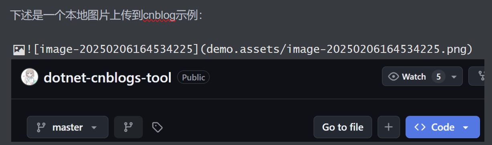
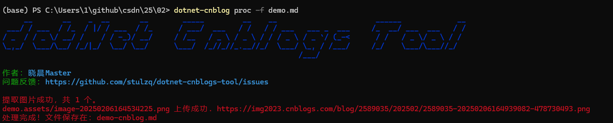
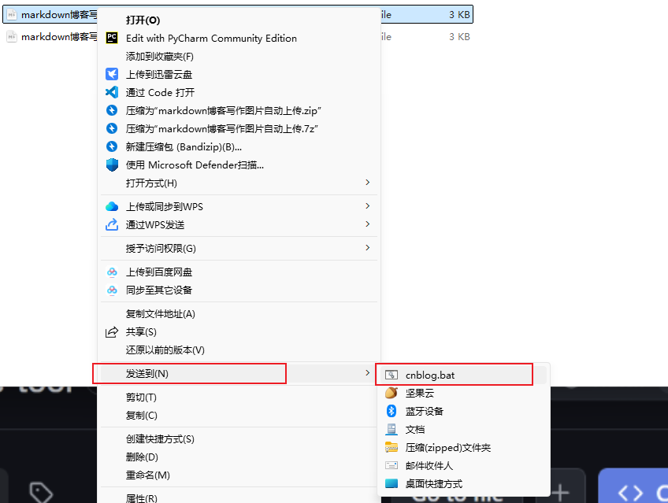
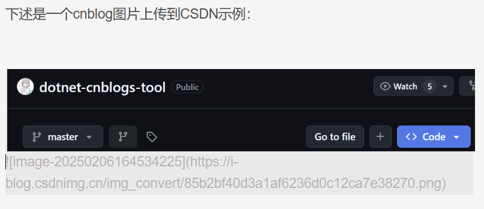

## 背景

目前大部分的博客都是基于 Typora 软件编写，其中的图片都是本地相对路径，以前都手动逐个复制图片上传到 CSDN，但这个过程很繁琐，故想着使用自动上传图片。

目前有以下特点可利用：

* [dotnet-cnblog](https://github.com/stulzq/dotnet-cnblogs-tool) 工具可自动把本地文件上传到 cnblog 博客园
* CSDN 会自动下载外链图片并存储在其服务器上。

## 简介

使用 `dotnet-cnblog` 工具，我们可以将本地 Markdown 文件中的图片自动上传至博客园，并生成一个包含网络图片地址的 Markdown 文件。然后，直接将该文件复制到 CSDN，CSDN 会自动存储这些图片。

此外，通过 `md2all` 工具，还可以转换格式后发布到微信公众号。

通过这种方式，不仅能够保留本地相对路径图片，还能确保博客园和 CSDN 也有图片备份，实现数据多重保障。

## dotnet-cnblog 图片自动上传到cnblog

dotnet-cnblog 安装，参考下述资料完成配置：

* https://github.com/stulzq/dotnet-cnblogs-tool

* [typora转换图片上传到博客园 ](https://www.cnblogs.com/shengliC/p/14410298.html)
* [如何高效的编写与同步博客（一）- 编写 ](https://www.cnblogs.com/stulzq/p/9043632.html) github 作者博客

重要提示：在进行cnblog的 **ID、用户名与密钥** 设置时，必须与cnblog博客后台的设置保持一致。




如上图所示，在本地的`demo.md`文件中，有一张本地图片，可以看到其中展示的本地相对路径。

```shell
dotnet-cnblog proc -f demo.md
```



运行上述命令后，会在当前文件夹中，生成一个新的`demo-cnblog.md` 文件，其中的图片地址都变成了cnblog的地址。


### 鼠标右键发送功能

使用 `dotnet-cnblog proc -f demo.md` 命令的方式对文件进行转换，显得过于繁琐。通过鼠标右键的发送功能利用脚本自动进行转换。[参考：dotnet-cnblog添加到右键发送到踩坑 ](https://www.cnblogs.com/l1j1ng/p/15408133.html)

按`win+r` 输入:

```shell
%AppData%\Microsoft\Windows\SendTo
```
进入目录后，创建一个`cnblog.bat`文件，通过编辑器在其中输入下述文本：

```shell
dotnet-cnblog proc -f %1
pause
```

便可是实现依据鼠标右键自动上传md中的图片到 cnblog 的功能：




## CSDN

若将生成的`demo-cnblog.md`中的内容复制到 CSDN上，如下图所示，则会发现CSDN会把该图片在自己的服务器上存一份，并且自动转成新的图片地址。



## 总结

通过 `dotnet-cnblog` 工具，我们可以：

1. **自动上传本地 Markdown 图片** 到博客园。
2. **生成 Markdown 文件**，其中的图片地址变为博客园外链。
3. **复制到 CSDN**，使 CSDN 自动存储图片。
4. **使用右键快捷方式**，大幅简化操作流程。

这种方法不仅节省时间，还能保证图片在多个平台上的可用性，提高博客写作的效率与便捷性。
