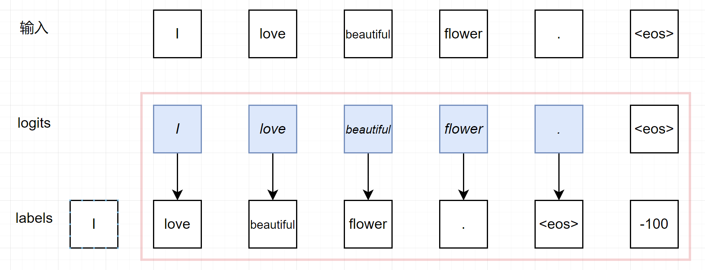
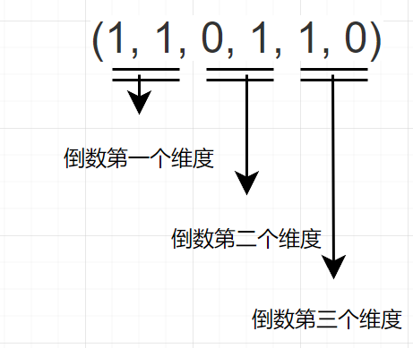

# 大模型损失函数计算之中的 pad 介绍

## 摘要

首先以框图的形式介绍大模型的损失函数的计算过程。由于在大模型损失函数计算过程中，用到了 pad ，故介绍一下pad方法的用法。

## 背景

在做语言大模型的微调训练的时候，看到损失函数计算里面有一个pad操作。发现我对这个pad方法的使用还不够了解，于是便学习一下这个pad方法的使用。

下述大模型的损失函数计算方法 `ForCausalLMLoss` 节选自：`transformers\src\transformers\loss\loss_utils.py`

```python
def ForCausalLMLoss(
    logits, labels, vocab_size: int, num_items_in_batch: int = None, ignore_index: int = -100, **kwargs
):
    # Upcast to float if we need to compute the loss to avoid potential precision issues
    logits = logits.float()
    labels = labels.to(logits.device)
    # Shift so that tokens < n predict n
    labels = nn.functional.pad(labels, (0, 1), value=ignore_index)
    shift_labels = labels[..., 1:].contiguous()

    # Flatten the tokens
    logits = logits.view(-1, vocab_size)
    shift_labels = shift_labels.view(-1)
    # Enable model parallelism
    shift_labels = shift_labels.to(logits.device)
    loss = fixed_cross_entropy(logits, shift_labels, num_items_in_batch, ignore_index, **kwargs)
    return loss
```

其中 `labels = nn.functional.pad(labels, (0, 1), value=ignore_index)` ，这里的 pad 方法是要介绍的内容。

众所周知，大模型损失计算，是与下一次词计算损失，如下图所示：



针对输入: `I love beautiful flower .`。经过 decoder 模型后，得到 `logits` tensor 其包含有隐藏信息 。

如上图所示，在损失值计算的过程中，labels 会向左移1位（采用切片实现），然后在最后填充一个 `-100`。（这个过程由transformer包提供实现，用户无需考虑，用户在原始数据构造的时候，只需要保证 label 与 input_ids 的 shape 一致即可。）

```python
labels = nn.functional.pad(labels, (0, 1), value=ignore_index)
```

上述pad方法实现的功能就是：在 labels 中，左边填充0个value，右边填充1个值，填充的是 ignore_index。

如上图红色框所示，其中是损失函数的计算，就是将当前值与下一个值计算损失。`.` 与`<eos>`停止符计算损失，`<eos>`是大模型停止文本生成的标志，不再预测下一词。这个实现就是通过设置ignore_index=-100实现，在label中设置为 -100的值，不会参与到损失函数的计算中。

## pad

上文关于大模型损失函数计算，已经介绍完毕，感觉上文大模型的损失函数计算才是精华部分。哈哈！

下面开始介绍 `from torch.nn.functional import pad`
在学这个 pad 方法的时候，首先问了GPT，然后也浏览了 pytorch的文档.[https://pytorch.org/docs/stable/generated/torch.nn.functional.pad.html](https://pytorch.org/docs/stable/generated/torch.nn.functional.pad.html)。

```python
torch.nn.functional.pad(input, pad, mode='constant', value=None) → Tensor
```

当时看这个GPT生成和文档中的例子，当时不理解 pad 为什么可以是2、4、6长度的元组。

假设 pad 是(left_num, right_num) ，其表示在最后一个维度进行填充，左边填充left_num个值，右边填充right_num个值。

下面进入代码实战：

```python
import torch
from torch.nn.functional import pad

IGNORE = -100
```

```python
a = torch.zeros(1, 2, 2)
a, a.shape
```

输出:

```python
(tensor([[[0., 0.],
          [0., 0.]]]),
 torch.Size([1, 2, 2]))
```

### pad 长度为2

pad 长度为 2， (1, 1) ：

```python
pad2 = pad(a, (1, 1), value=IGNORE)
pad2, pad2.shape
```

输出：

```python
(tensor([[[-100.,    0.,    0., -100.],
          [-100.,    0.,    0., -100.]]]),
 torch.Size([1, 2, 4]))
```

表示在最后一个维度，左边填充一个-100，右边填充一个-100。填充会导致维度扩充，在原始的a的shape(1,2,2)的基础上进行维度扩展：(1, 2, 2+(1+1))

### pad 长度为4

pad 长度为 4， (1, 1, 0, 1)：

```python
pad4 = pad(a, (1, 1, 0, 1), value=IGNORE)
pad4, pad4.shape
```

```python
(tensor([[[-100.,    0.,    0., -100.],
          [-100.,    0.,    0., -100.],
          [-100., -100., -100., -100.]]]),
 torch.Size([1, 3, 4]))
```

(1, 1, 0, 1)： 左测的 (1, 1) 就是前面pad长度为2的情况，右侧 (0, 1) 表示在倒数第二个维度进行维度扩展。

在原始的a的shape(1,2,2)的基础上进行维度扩展，(1, 2+(0+1), 2+(1+1))变成 (1, 3, 4)。
只要大家能够算出最终的shape的形状，那么里面的值也很好理解，只要是填充的，不是原有的，都是新填充进去的 -100。

### pad 长度为6

pad 长度为 6， (1, 1, 0, 1, 1, 0)：

```python
pad6 = pad(a, (1, 1, 0, 1, 1, 0), value=IGNORE)
pad6, pad6.shape
```

输出：

```python
(tensor([[[-100., -100., -100., -100.],
          [-100., -100., -100., -100.],
          [-100., -100., -100., -100.]],
 
         [[-100.,    0.,    0., -100.],
          [-100.,    0.,    0., -100.],
          [-100., -100., -100., -100.]]]),
 torch.Size([2, 3, 4]))
```

下图是对pad长度为6的一个解释：



## 进阶

留下一个思考：大模型的有监督微调 SFT 模型微调过程如何实现的？其中最重要的部分 label 要如何使用 -100，忽略用户输入的损失计算？

