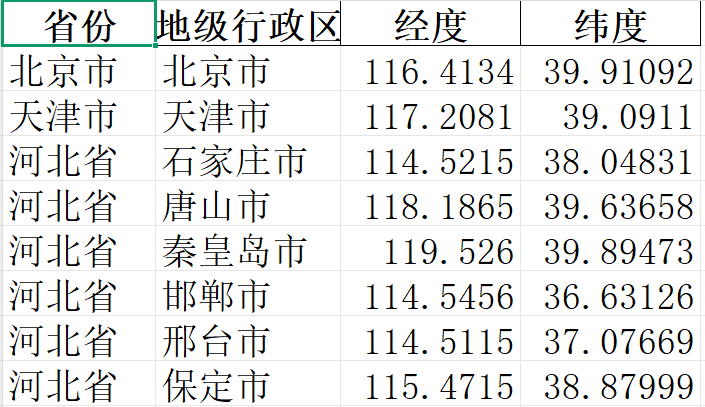

# 全国两地之间的距离与通勤时间

该项目完整的技术路线图，如下所示：


## 简介

调用百度地图的API：

* https://lbsyun.baidu.com/faq/api?title=webapi/guide/webservice-geocoding-base 地理编码
* https://lbsyun.baidu.com/faq/api?title=webapi/guide/webservice-lwrouteplanapi/dirve 驾车路线规划

全国333个市级单位的地址 `CityList_333.xlsx`


通过调用地理编码的API获取这些地址对应的经纬度,  `CityList_333_经纬度_百度API.xlsx`:



通过地址之间的两两组合，构建一个源地址与目标地址的


针对上述构建完成的矩阵调用地图的API获取两地之间的路程与通勤时间。

A-B 与 B-A，是重复的只需要调用一次API。无需重复调用。

## 使用

在当前文件夹中新建 `.env` 文件：

```
api_key=百度地图密钥
```

根据上图所示的流程图逐个运行。
