## 信息抽取

## 基于知识蒸馏的半监督古籍实体抽取

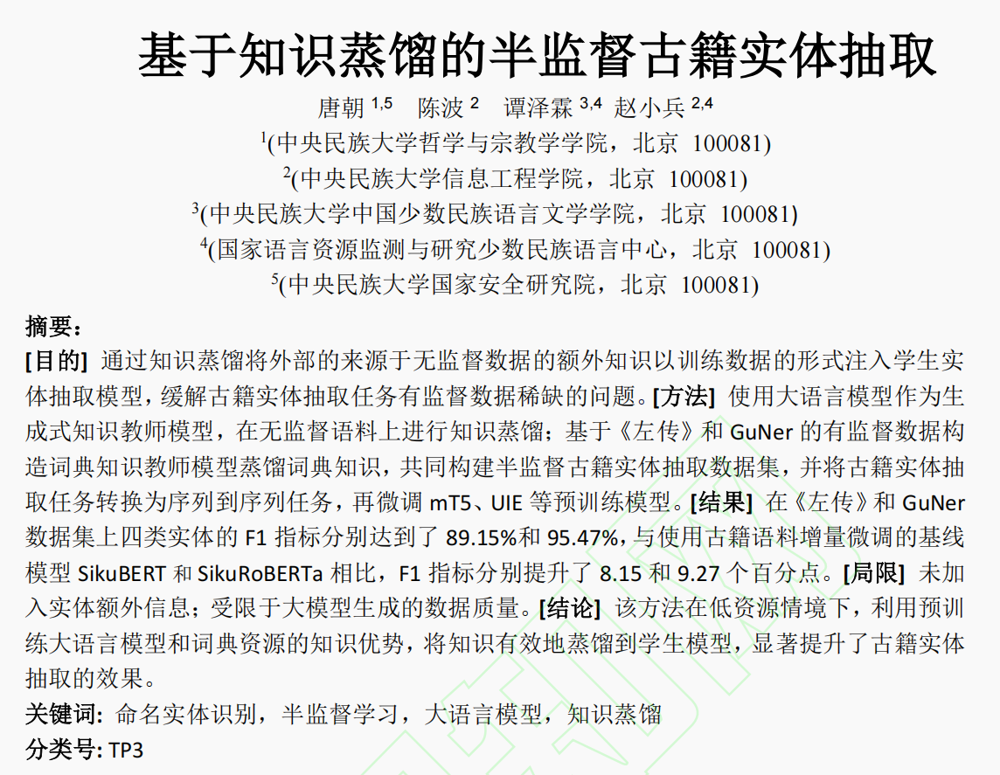

### 数据集

本文在有监督数据集的基础上构建了两个自标注数据集。通过采用不同组合形式的训练数据微调学生模型，并在两个测试数据集上进行评估。**词典知识教师模型**和**生成式知识教师模型**获得的数据仅被用于训练阶段微调学生模型。验证集和测试集的构建，则通过从有监督数据中随机抽取样本来完成。

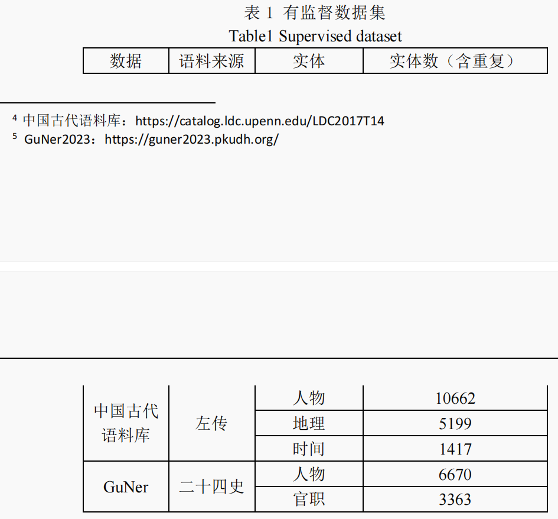

* 中国古代语料库：https://catalog.ldc.upenn.edu/LDC2017T14
* GuNer2023：https://guner2023.pkudh.org/

下述是他们使用大模型标注的数据集：

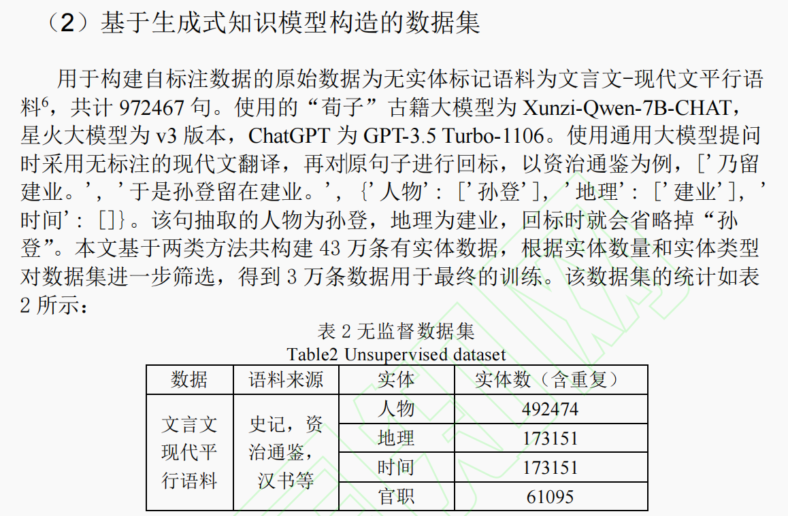

### 模型

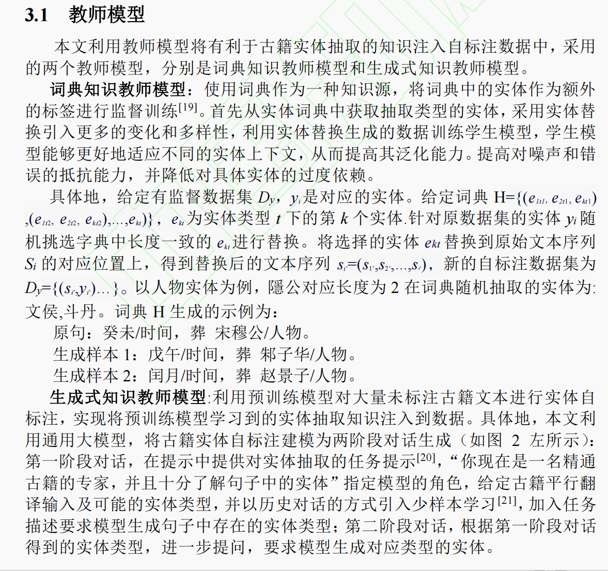

这个教师模型实质上做的是数据增强的工作。在句子中，把同一类的实体进行替换。

在表述中提到挑选字典长度一致的ekt 进行替换，这里的长度一致，我认为是作者不想花时间去修改label。

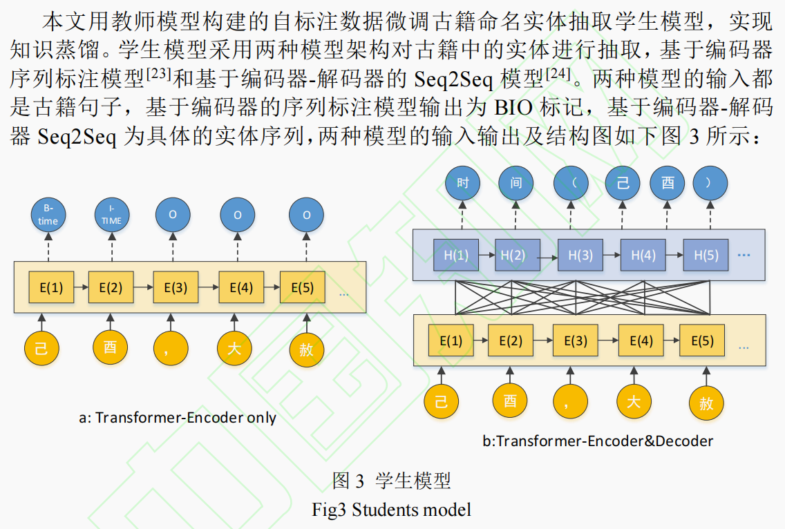

他们提到了使用BIO标记，我个人认为实体抽取的BIO标记还没学过的就不用学了，因为现在是大模型生成式的时代。

### 实验结果

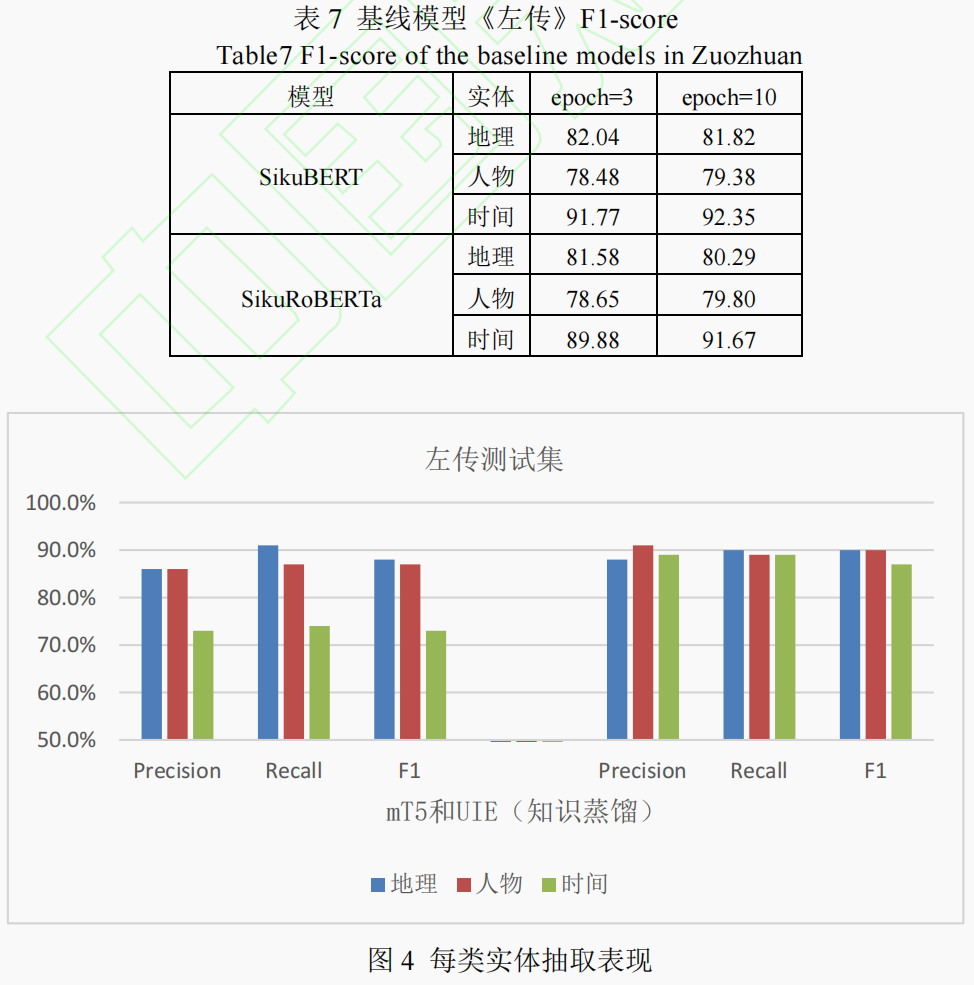

## 基于大语言模型的专利命名实体识别方法研究

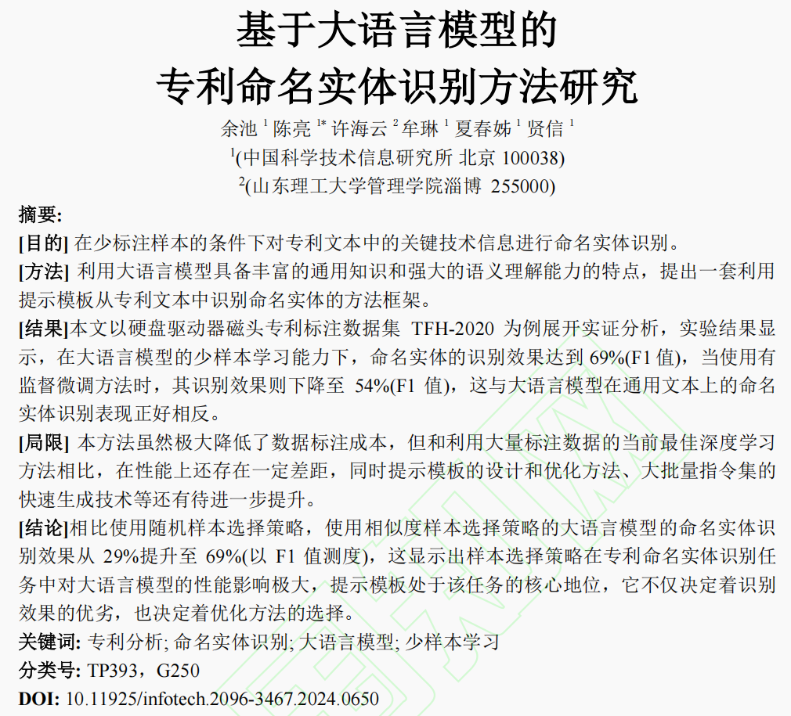

### 数据集

L.Chen 等[14]收集了专利领域和通用领域具有代表性的七个命名实体标注数据集

数据集构造过程：

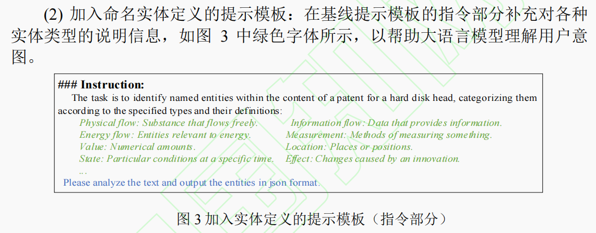

给每个实体的类型加入提示词，这一部分的提示词很难写。如果写的不好，反而效果还不如不写这个类型的说明信息。因为人所有理解的类型，与数据集中真实的类型情况可能会有偏差，反而导致加了类型说明的效果会下降。

### 评估公式

看到评估公式的一种新写法：

### 实验

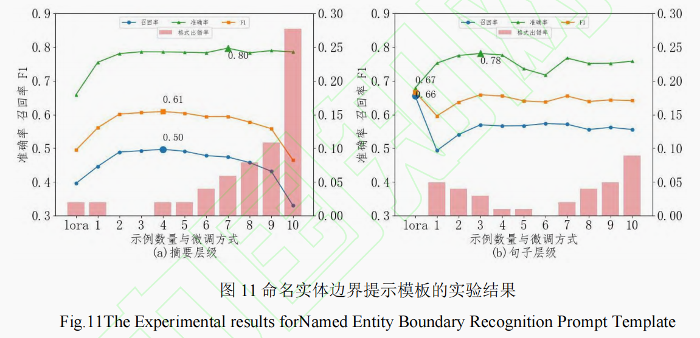

看横坐标，第一个是Lora，其后都是不微调的基于示例的上下文学习。

论文原文：

> 在摘要层级任务上，LoRA 微调后的命名实体效果甚至低于仅使用 1 个示例的上下文学习方法；但在句子层级任务上，LoRA微调效果明显，虽然准确率
>
> 依然低于仅使用 1 个示例的上下文学习方法，但在召回率和 F1 值上获得最高得分。这表明微调指令的文本长度越长，大语言模型理解起来就越困难，高效微
>
> 调的提升效果就越小。

LoRA的微调效果不如提示学习，我猜测这是因为他们的微调的效果不好。（我感觉问题出在他们的LoRA微调上。根据我以往的LoRA微调经验，LoRA微调的效果要远远超过上下文学习）

现在的大模型，比如 deepseek-r1，由于使用到了强化学习，参杂很多上下文示例反而效果不会很好。基于示例的上下文学习，还有一个问题，会导致大模型混淆示例文本与要完成抽取的文本，我就遇到在ollama 7B的模型中，一些抽取出来的实体来自于前面的示例文本。
上下文示例的数量与样例的筛选，都是前一段时间热衷做的工作。这部分现在不是一个必须学的内容。

题外话：大模型抽取实体，我想起来在 EMNLP会议论文中，有一篇论文是这么做的：开源本地推理先推理一遍，再调用闭源模型再推理一遍。因为开源模型本地推理速度快，闭源模型的实力更强大可以起到最终把关的作用。

## 基于数据增强和多任务学习的突发公共卫生事件谣言识别研究

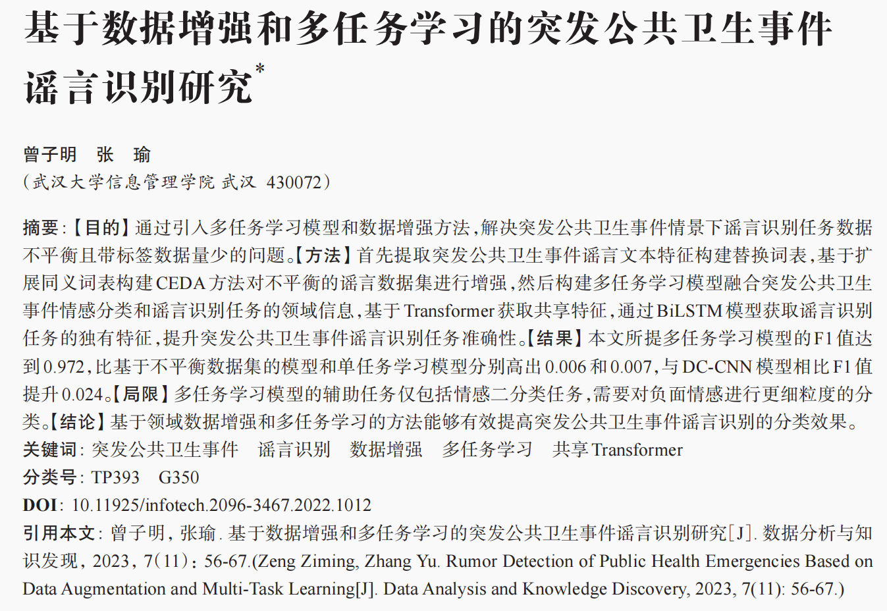

主要看看CEDA方法是怎么做数据增强的。

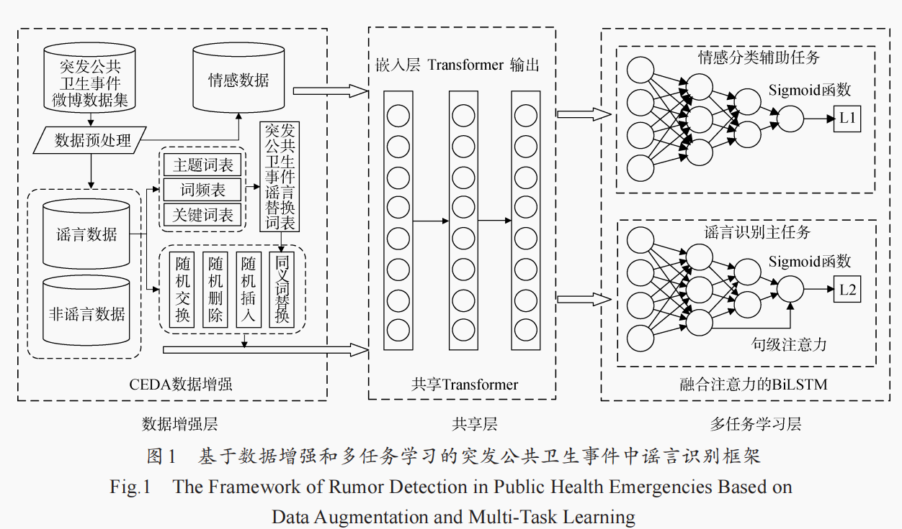

### 数据集

哈尔滨工业大学社会计算与信息检索研究中心《同义词词林（扩展版）》[1]进行扩展，基于扩展同义词表进行同义词替换。

对CHECKED数据集[2]和腾讯事实核查平台[3]中的1062条突发公共卫生事件谣言文本进行主题、词频和权重分析。

* [1] https://www.ltp-cloud.com/download
* [2] https://github.com/cyang03/CHECKED
* [3] https://vp.fact.qq.com/home

CEDA 数据增强示例：

### 实验结果

在数据增强的过程中，他们分别对每一种数据增强的方法都做了实验。

图2 探索了不同的文本改变率，对F1值的影响。

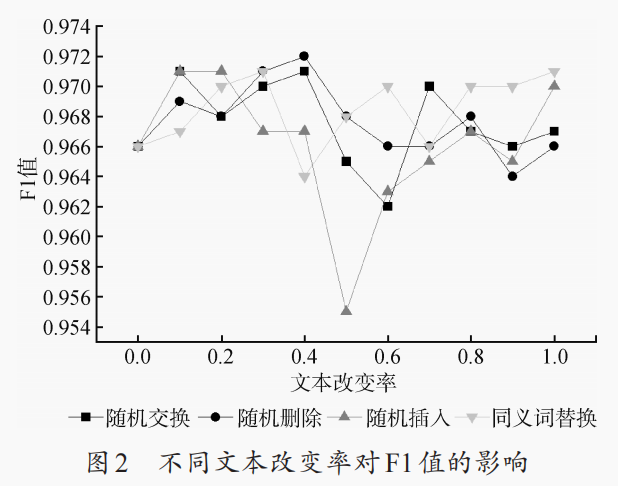

表8 应该是基于图2每种方法最佳的文本改变率进行的实验评估。

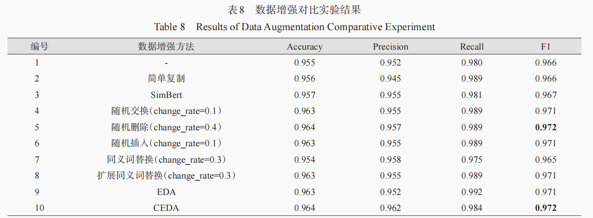

## 参考

* 论文下载自 中国知网