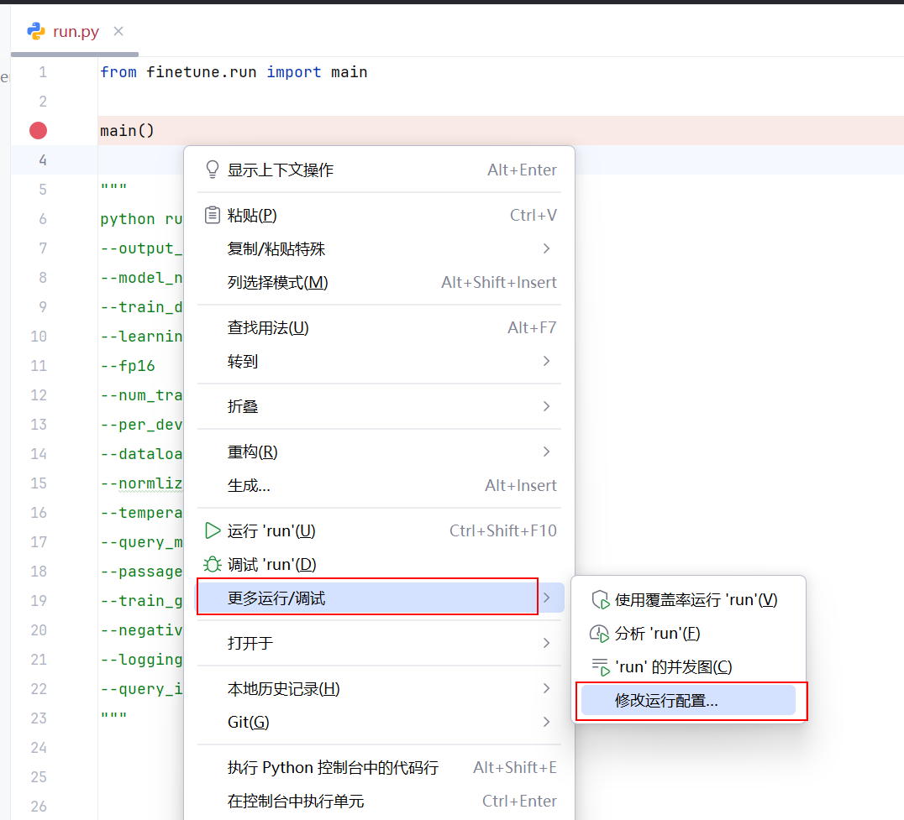

# embedding 模型微调

## 背景

在理解与学会了Naive RAG的框架流程后，就很自然地关注到embedding模型，与问题相关的文本召回，也有很多论文在做这方面的创新。

以前一直不知道embedding模型是如何微调出来的，一直听说是微调BERT，但是不知道是怎么微调出来的。直到在B站上看到bge模型微调的视频[参考资料4]才理解。

于是便想着自己也微调出一个 embedding模型。涉及到下面三个阶段：

* 数据集制作
* 模型训练
* 评估


## debug 【选看】

* 视频教程，bge模型微调流程：https://www.bilibili.com/video/BV1eu4y1x7ix/

找到23年10月份的代码，debug。新版的加了抽象类与继承，增加了很多额外的东西，使用早期版本debug起来更聚焦一些。


```
python run.py
--output_dir output
--model_name_or_path BAAI/bge-large-zh-v1.5
--train_data ./toy_finetune_data.jsonl
--learning_rate 1e-5
--fp16
--num_train_epochs 5
--per_device_train_batch_size 2
--dataloader_drop_last True
--normlized True
--temperature 0.02
--query_max_len 64
--passage_max_len 256
--train_group_size 2
--negatives_cross_device
--logging_steps 10
--query_instruction_for_retrieval "为这个句子生成表示以用于检索相关文章：" 
```

由于需要传递参数再运行脚本，需要在pycharm配置一些与运行相关的参数：




下述是embedding计算损失的核心代码，这里的query与passage都是batch_size数量的输入，如果只是一条query与passage，大家理解起来就容易很多。由于这里是batch_size数量的输入，代码中涉及到矩阵运算会给大家带来理解困难。

比较难理解的是下述代码，这里的target 其实就是label：

```python
target = torch.arange(
                scores.size(0), device=scores.device, dtype=torch.long
            )
target = target * (p_reps.size(0) // q_reps.size(0))
```

p_reps 是相关文本矩阵， q_reps 是问题矩阵。每一个问题都对应**固定数量**的相关文本。`p_reps.size(0) // q_reps.size(0)` 是每个问题对应的**相关文本的数量**。下一行的target 乘以 相关文本的块数，得到query对应的 `Gold Truth`(也称 pos 文本)的下标，因为在每个相关文本中，第一个位置都是正确文本，其后是负样本，这些 `Gold Truth` 下标之间的距离是固定，通过乘法就可以计算出每个 `Gold Truth` 的下标。

额外补充【选看】：

大家不要错误的以为每个问题只和自己的相关文本计算score。真实的情况是，在batch_size的数据中，每个问题会与所有的相关文本计算score。根据上述代码可看出 target 最大的取值是：`query的数量 x 相关文本数量`，这也印证了每个问题会与所有的相关文本都计算score。故我们在随机采样负样本的时候，负样本数量设置的太小也不用太担心，因为在计算过程中负样本的数量会乘以 batch_size。

【注意】：query的数量 = batch_size


## 资源分享

上述的代码开源在github平台，为了不增大github仓库的容量，数据集没有上传到github平台。若希望直接获得完整的项目文件夹，从下述分享链接进行下载：


## 参考资料

[1] BAAI官方微调教程： https://github.com/FlagOpen/FlagEmbedding/blob/master/Tutorials/7_Fine-tuning/7.1.2_Fine-tune.ipynb
[2] BAAI官方评估教程：https://github.com/FlagOpen/FlagEmbedding/blob/master/Tutorials/4_Evaluation/4.1.1_Evaluation_MSMARCO.ipynb
[3] 多文档知识图谱问答：https://jieshen.blog.csdn.net/article/details/146390208
[4] bge模型微调流程：https://www.bilibili.com/video/BV1eu4y1x7ix/
[5] FlagEmbedding 旧版本可用于debug的代码：https://github.com/FlagOpen/FlagEmbedding/blob/9b6e521bcb7583ed907f044ca092daef0ee90431/FlagEmbedding/baai_general_embedding/finetune/run.py