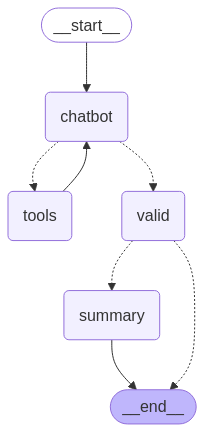
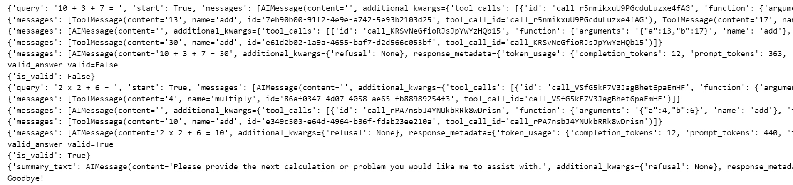

## 介绍

langgraph调用工具练手项目

本文代码开源地址：[https://github.com/JieShenAI/csdn/tree/main/25/04/math_agent](https://github.com/JieShenAI/csdn/tree/main/25/04/math_agent)

此前已经写过了一篇 [LangGraph 自定义工具调用，大模型使用加法和乘法工具的工作流实现](https://blog.csdn.net/sjxgghg/article/details/141194328)，流程图如下图所示，结构比较简单， action 代表工具调用。


这一篇的代码相比上一篇，不仅新增加了大模型答案valid验证器与处理流程总结 summary节点，还增加了提示词模板的使用。langgraph的流程图如下：



上述流程的介绍如下：

首先用户输入问题，chatbot 会选择调用工具 tools，工具生成答案，chatbot再决定是否调用工具，在这里一直重复。若用户的问题已经解决后，chatbot 根据历史对话记录知道目前不需要调用工具，那么他不会生成工具调用。

chatbot 不调用工具，就代表计算过程结束了，根据提示词设置，chatbot 应该输出用户输入的计算式和答案。由 valid 判断计算是否正确，若正确 is_valid 设置为 True，否则设置为 False。summary 根据历史的对话记录，总结一下这个流程，发现summary在数学计算的过程中表现不好，但为了给大家提供思路，还是保留了 summary这个结点。

## 代码实战

参考资料：

\* [https://python.langchain.com/docs/how_to/tools_few_shot/](https://python.langchain.com/docs/how_to/tools_few_shot/)


```python
from dotenv import load_dotenv

load_dotenv()

import json
from typing import Literal
from langgraph.graph import END, StateGraph, START
from pydantic import BaseModel, Field
from langchain_openai import ChatOpenAI
from langchain_core.messages import HumanMessage, AIMessage, ToolMessage, SystemMessage
from langgraph.checkpoint.memory import MemorySaver
from langchain_core.prompts import ChatPromptTemplate, PromptTemplate
from langchain_core.tools import tool
from langchain.output_parsers import PydanticOutputParser
from typing import Annotated

from typing_extensions import TypedDict
from langgraph.graph.message import add_messages

memory = MemorySaver()
model_name = "gpt-4o-mini"
```

计算工具：

```python
@tool
def add(a: int, b: int) -> int:
    """Adds a and b.

    Args:
        a: first int
        b: second int
    """
    return a + b


@tool
def multiply(a: int, b: int) -> int:
    """Multiplies a and b.

    Args:
        a: first int
        b: second int
    """
    return a * b
```

提示词与少样本提示的例子：

```python
# 在系统提示词中，暗示大模型它的数据能力不行，要求它使用工具完成计算。
# 不然，它就直接算出结果，本实验就没有意义了。
system_prompt = """You are bad at math but are an expert at using a calculator. 
Use past tool usage as an example of how to correctly use the tools.
You can only call a tool at a time.
Please step by step to solve problem.
"""

examples = [
    HumanMessage("317253 x 128472 + 4 = ?"),
    AIMessage(
        "",
        tool_calls=[
            {"name": "multiply", "args": {"x": 317253, "y": 128472}, "id": "111"}
        ],
    ),
    ToolMessage("40758127416", tool_call_id="111"),
    AIMessage(
        "",
        tool_calls=[{"name": "add", "args": {"x": "40758127416", "y": 4}, "id": "222"}],
    ),
    ToolMessage("40758127420", tool_call_id="222"),
    AIMessage(
        "317253 x 128472 + 4 = 40758127420",
    ),
]
```


State定义：

* messages 尾部追加，无法删除历史记录，
* start 默认是False，在第一次进入chatbot时，设置为True，此时chatbot的message就是用户输入的query
* query 用户输入的问题，可以送给验证器，验证用户的问题是否已经解决
* is_valid 工具调用的最终计算结果是否正确
* summary_text 大模型处理流程的总结

```python
class State(TypedDict):
    messages: Annotated[list, add_messages]
    is_valid: bool
    query: str
    summary_text: str
    start: bool = False
```


```python
def chatbot(state: State):
    tools = [add, multiply]
    # 使用模型绑定工具
    llm = ChatOpenAI(model=model_name)
    llm_with_tools = llm.bind_tools(tools)
    
    chat_template = ChatPromptTemplate.from_messages([
        SystemMessage(system_prompt),
        # example
        HumanMessage("The following is an example."),
        *examples,
        # query
        HumanMessage("Refer to the above example to solve the following problems:\n"),
        *state["messages"],
    ])
    chain = chat_template | llm_with_tools
    ai_answer = [chain.invoke({})]
    
    start = state["start"]
    if start is False:
        start = True
        query = state["messages"][-1].content
        return {"query": query, "start": True, "messages": ai_answer}

    return {"messages": ai_answer}
```

系统提示词与少样本提示的例子不能放入到 messages中，不然会增加上下文，而且也会干扰大模型判断。

ChatPromptTemplate 中，把历史对话的所有 `state["messages"]` 都输入给大模型，让大模型生成下一步工具调用或者结束工具调用生成最终的结果。

工具节点：

```python
class BasicToolNode:
    """A node that runs the tools requested in the last AIMessage."""

    def __init__(self, tools: list) -> None:
        self.tools_by_name = {tool.name: tool for tool in tools}

    def __call__(self, inputs: dict):
        if messages := inputs.get("messages", []):
            message = messages[-1]
        else:
            raise ValueError("No message found in input")
        outputs = []
        for tool_call in message.tool_calls:
            tool_result = self.tools_by_name[tool_call["name"]].invoke(
                tool_call["args"]
            )
            outputs.append(
                ToolMessage(
                    content=json.dumps(tool_result),
                    name=tool_call["name"],
                    tool_call_id=tool_call["id"],
                )
            )
        return {"messages": outputs}
```

大模型会生成 function call，解析大模型生成工具调用，接收其中的参数，并调用对应的工具得到对应的计算结果。


```python
def route_chatbot(
    state: State,
):
    """
    Use in the conditional_edge to route to the ToolNode if the last message
    has tool calls. Otherwise, route to the end.
    """
    if isinstance(state, list):
        ai_message = state[-1]
    elif messages := state.get("messages", []):
        ai_message = messages[-1]
    else:
        raise ValueError(f"No messages found in input state to tool_edge: {state}")
    if hasattr(ai_message, "tool_calls") and len(ai_message.tool_calls) > 0:
        return "tools"
    # 转移到 valid 节点
    return "valid"


def valid_node(state: State):
    """
    浏览之前所有的message，判断计算结果是否正确？
    """
    end_format = """
    返回格式：
    {
    "valid": true  # 或 false
    }
    """.strip()
    
    chat_prompt = ChatPromptTemplate.from_messages([
        HumanMessage(content="判断下述大模型的数学工具的参数传递与调用是否正确。"),
        HumanMessage(f"用户问题如下所示:\n{state["query"]}"),
        HumanMessage(f"计算过程如下所示:\n {state["messages"][-1].content}\n{end_format}"),
        # *state["messages"][1:],
    ])

    class Binary_Answer(BaseModel):
        """判断数学计算过程是否正确，判断工具的调用是否能得到正确的结果"""

        valid: bool = Field(description="返回True代表计算正确，否则返回False")

    parser = PydanticOutputParser(pydantic_object=Binary_Answer)
    llm = ChatOpenAI(model=model_name)
    chain = chat_prompt | llm | parser
    valid_answer = chain.invoke({})
    # print("valid_answer", valid_answer)
    if valid_answer:
        return {"is_valid": valid_answer.valid}
    else:
        return {"is_valid": False}

def route_valid(state: State) -> Literal["summary", END]:
    is_valid = state["is_valid"]
    if is_valid:
        return "summary"
    return END

def summary(state: State):
    """
    总结上述计算过程
    """
    chat_prompt = ChatPromptTemplate.from_messages([
        SystemMessage(content="总结下述计算过程。"),
        *state["messages"],
    ])
    llm = ChatOpenAI(model=model_name)
    chain = chat_prompt | llm
    return {"summary_text": chain.invoke({})}
```

valid_node 节点，使用 `PydanticOutputParser` 解析大模型生成的结果，获取大模型判断的验证是否通过。

```python
graph_builder = StateGraph(State)

graph_builder.add_node("chatbot", chatbot)

# tool
tool_node = BasicToolNode(tools=[add, multiply])
graph_builder.add_node("tools", tool_node)

graph_builder.add_conditional_edges(
    "chatbot",
    route_chatbot,
    {"tools": "tools", "valid": "valid"},
)

graph_builder.add_node("valid", valid_node)
graph_builder.add_conditional_edges(
    "valid",
    route_valid,
    {"summary": "summary", END: END},
)

graph_builder.add_node("summary", summary)
graph_builder.add_edge("summary", END)

# Any time a tool is called, we return to the chatbot to decide the next step
graph_builder.add_edge(START, "chatbot")
graph_builder.add_edge("tools", "chatbot")
graph = graph_builder.compile(checkpointer=memory)
```

设置 memroy，完成工作流编排。


```python
def stream_graph_updates(user_input: str):
    for event in graph.stream(
        {"messages": [{"role": "user", "content": user_input}], "start": False},
        config={"configurable": {"thread_id": "2"}},
    ):
        for value in event.values():
            print(value)
            # if "messages" in value.keys():
            #     print(event, "Assistant:", value["messages"][-1].content)

while True:
    user_input = input("User: ")
    if user_input.lower() in ["quit", "exit", "q"]:
        print("Goodbye!")
        break
    stream_graph_updates(user_input)
```

输出：



上述展示了运行过程中的两个例子，一个计算错误 valid为False。一个验证正确 valid 为 True。

