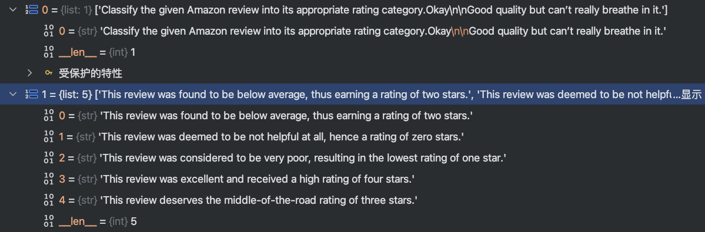

# FlagEmbedding debug

当前文章是我对 FlagEmbedding debug 分析的一个过程。其实还没有debug完成，只分析了一部分，为了方便后续回忆，才保存在此，建议读者忽略，因为下述文章的逻辑没有梳理清楚。


AbsRunner.py 加载 load_data_collator、load_data_collator。

```python
self.train_dataset = self.load_data_collator()
self.data_collator = self.load_data_collator()
self.trainer = self.load_trainer()
```

```python
def load_train_dataset(self) -> AbsEmbedderTrainDataset:
    """Loads the training dataset based on data arguments.

    Returns:
        AbsEmbedderTrainDataset: The loaded dataset instance.
    """
    if self.data_args.same_dataset_within_batch:
        train_dataset = AbsEmbedderSameDatasetTrainDataset(
            args=self.data_args,
            default_batch_size=self.training_args.per_device_train_batch_size,
            seed=self.training_args.seed,
            tokenizer=self.tokenizer,
            process_index=self.training_args.process_index,
            num_processes=self.training_args.world_size
        )
        self.training_args.per_device_train_batch_size = 1
        self.training_args.dataloader_num_workers = 0   # avoid multi-processing
    else:
        train_dataset = AbsEmbedderTrainDataset(
            args=self.data_args,
            tokenizer=self.tokenizer
        )
    return train_dataset
```

data_args.same_dataset_within_batch 决定加载 AbsEmbedderSameDatasetTrainDataset 还是 AbsEmbedderTrainDataset。

TODO：这两个数据集有什么区别？

- **`same_dataset_within_batch`**: All samples in the same batch comes from the same dataset.

没有使用 same_dataset_within_batch ，数据集的只有三个指标。query, passages, teacher_scores

使用 same_dataset_within_batch ，数据集的只有四个指标。queries, passages, teacher_scores, no_in_batch_neg_flag

接下来再观察两个数据集的query, passages的input_ids的shape是否一样？


data_collator 的返回结果：

no_in_batch_neg_flag 属于 dataset的参数，默认为False。 数据集文件夹结尾是no_in_batch_neg才为True。

```python
# Add `no_in_batch_neg` **suffix** to `data_dir` to indicate that this dataset does not use in-batch negatives
no_in_batch_neg_flag = data_dir.endswith('no_in_batch_neg')
```

no_in_batch_neg_flag 是什么 与 same dataset 没有关系。


两个数据集经过 data_collator 处理之后的结果有何不同：


Same_dataset 有一个数量减少，这个原因是 same_dataset 会把用户问题进行合并。

```
same_args_d["per_device_train_batch_size"] = 4
```

same_dataset_within_batch为True的时候，修改 batch_size 会影响数据集，数据集就会把相同数据集放到一个batch里面计算。我能理解这个！

通过下标取值的时候，发现 samedataset 每次取的值不一样。

same_dataset_within_batch为False的时候，在微调的时候如果有多个数据集，同一个batch里面会混有多个数据集吗？那么这些多个数据集混在一起，如何进行训练？

针对下述数据集的格式进行猜测。同一个类别的数据放到一起。共享相同的负样本。

```python
(['Given a web search query, retrieve relevant passages that answer the query._________ justice is designed to repair the harm to victim, the community and the offender caused by the offender criminal act. question 19 options:', 'Given a web search query, retrieve relevant passages that answer the query.)what was the immediate impact of the success of the manhattan project?'], 

['Restorative justice The approach is based on a theory of justice that considers crime and wrongdoing to be an offense against an individual or community, rather than the State. Restorative justice that fosters dialogue between victim and offender has shown the highest rates of victim satisfaction and offender accountability.', '- Social justice is justice in terms of the distribution of wealth, opportunities, and privileges within a society. Classically,  justice  (especially corrective justice or distributive justice) ensured that individuals both fulfilled their societal roles and received what was their due from society.', 'Retribution Retribution is perhaps the most intuitive - and the most questionable - aim of punishment in the criminal law. Quite contrary to the idea of rehabilitation and distinct from the utilitarian purposes of restraint and deterrence, the purpose of retribution is actively to injure criminal offenders, ideally in proportion with their injuries to society, and so expiate them of guilt.', "- Economic justice is a component of social justice. It's a set of moral principles for building economic institutions, the ultimate goal of which is to create an opportunity for each person to create a sufficient material foundation upon which to have a dignified, productive, and creative life beyond economics.", 'Restorative Justice • Restorative Justice can be utilized in crimes of severe violence or non-violent crimes as well as with juvenile offenders. • Restorative Justice is an approach to crime which puts the victim or the victim’s family first and fully acknowledges the harm caused by the offender.', '- Punishment should be swift and certain. The purpose of the criminal justice system is to prevent crime through deterrence. According to this line of thinking, a potential criminal will decide against committing a crime because the punishment would be too costly.', 'How Does the Criminal Justice System Work? Throughout each stage of the process, constitutional protections exist to ensure that the rights of the accused and convicted are respected. These protections balance the need of the criminal justice system to investigate and prosecute criminals with the fundamental rights of the accused (who are presumed innocent).', '- will serve the community and enhance public trust and confidence in the administration of justice through: 1  The impartial and timely resolution of disputes, 2  Ensuring compliance with the law and court orders, and. 3  Fostering a vital court-community relationship that promotes equal access to the courts.', 'Introduction The presence of communication amid scientific minds was equally important to the success of the Manhattan Project as scientific intellect was. The only cloud hanging over the impressive achievement of the atomic researchers and engineers is what their success truly meant; hundreds of thousands of innocent lives obliterated.', "Atomic Glossary The Manhattan Project was the code name for America's atomic bomb development efforts during World War II. Its name originated from the fact that it was part of the U. S. Army Corps of Engineers and organized under the Manhattan Engineer District (MED) in New York City.", 'What impacts did benjamin harrison have on america while in office? Sorry, something has gone wrong. Best Answer: The greatest positive impact during his administration was the passing of the Sherman Anti-Trust Act of 1890, the first federal act to regulate trusts.', '- The Manhattan Project was a US government project used to develop a nuclear bomb. The undertaking lasted form 1942 to 1946, when...', 'The Cold War Museum In June of 1942 the War Department’s Army Corps of Engineers took charge of the effort to develop an atomic bomb. The subsequent top-secret project (code named Manhattan) cultivated a complex, but cooperative relationship between science, industry, the government, and the army.', 'Moments in U.S. Diplomatic History Only later did we learn through Gorge that we had a ringside view of the Doolittle raid [the daring air attack on Tokyo on April 18, 1942, which was designed to show that Japan was vulnerable and to boost U.S. morale after Pearl Harbor]….', 'The Manhattan Project Manhattan Project. The Manhattan Project was a secret military project created in 1942 to produce the first US nuclear weapon. Fears that Nazi Germany would build and use a nuclear weapon during World War II triggered the start of the Manhattan Project, which was originally based in Manhattan, New York.anhattan Project. The Manhattan Project was a secret military project created in 1942 to produce the first US nuclear weapon. Fears that Nazi Germany would build and use a nuclear weapon during World War II triggered the start of the Manhattan Project, which was originally based in Manhattan, New York.', "- Roosevelt agreed and placed General Leslie Groves and physicist J. Robert Oppenheimer in charge of the Manhattan Project two years later. The name Manhattan Project was the code word for the development of the atomic bomb. On July 16, 1945, the first atomic bomb was tested at the Trinity Site in New Mexico.The weapon was later used against the Japanese to end World War II.eginning in June 1942 during World War II, the United States' Manhattan Project brought together scientists and military experts to create the world's first atomic bomb."], 
None, False)
```

same_collator 处理这个数据，不知道怎么在做数据处理


## standard_model.py

原始的模式，所有的数据集都混在一起，检索数据集的影响不会很大。但是分类与聚类的效果应该不好，因为一个batch会多条数据的时候，可能有一些不是负样本。


## Same_dataset

SameDataset 会把train_batch_size 设置为1。那 groupsize是多少？

```python
train_dataset = AbsEmbedderSameDatasetTrainDataset(
                args=self.data_args,
                default_batch_size=self.training_args.per_device_train_batch_size,
                seed=self.training_args.seed,
                tokenizer=self.tokenizer,
                process_index=self.training_args.process_index,
                num_processes=self.training_args.world_size
            )
self.training_args.per_device_train_batch_size = 1
```


data_args.sub_batch_size

```
data_collator = EmbedCollator(
            tokenizer=self.tokenizer,
            query_max_len=self.data_args.query_max_len,
            passage_max_len=self.data_args.passage_max_len,
            sub_batch_size=self.training_args.sub_batch_size,
            pad_to_multiple_of=self.data_args.pad_to_multiple_of,
            padding=True,
            return_tensors="pt"
        )
```


**为什么 文档数量是5 ？**



sub_batch_size 是None。
train_batch_size 还是生效了的。


Same dataset 是否一定使用 SameDatasetCollator。

SameDatasetCollator 的代码可以发现其只用了第一个元素。


我发现分类与聚类，其实是有前缀的提示词，提示词该如何添加？


```
{"query": "Motor attention to the tactile modality induces sensory attenuation for sounds", "pos": ["Serotonin signals through postsynaptic G\u03b1q, Trio RhoGEF, and diacylglycerol to promote C. elegans egg-laying circuit activity and behavior"], "neg": ["ALLOPURINOL BLOCKS THE AORTIC ANEURYSM IN A MOUSE MODEL OF MARFAN SYNDROME VIA REDUCING AORTIC OXIDATIVE STRESS", "Reduced glutathione decreases cell adhesion and increases cell volume.", "Transcriptional condensates formed by phase-separated ALOG family proteins control shoot meristem maturation for flowering", "A terrain treadmill to study animal locomotion through large obstacles", "Structural basis for the inhibition of the Bacillus subtilis c-di-AMP cyclase CdaA by the phosphoglucomutase GlmM", "Similarities Between Bacterial GAD and Human GAD65: Implications in Gut Mediated Autoimmune Type 1 Diabetes", "A novel two-generation approach to the population dynamics of gregarious parasitoids", "The role of Kabuki Syndrome genes KMT2D and KDM6A in development: Analysis in Human sequencing data and compared to mice and zebrafish", "Fusobacterium nucleatum induces pancreatic cancer cell proliferation and migration by regulating host autocrine and paracrine signaling", "Structural Analysis of Spike Protein Mutations in the SARS-CoV-2 P.3 Variant", "Diverse stem-chondrichthyan oral structures and evidence for an independently acquired acanthodid dentition", "Changes to the mtDNA copy number during yeast culture growth", "Differential fate of acellular vascular scaffolds in vivo involves macrophages and T-cell subsets", "C. elegans PEZO-1 is a Mechanosensitive Ion Channel Involved in Food Sensation", "Omicron BA.2 specifically evades broad sarbecovirus neutralizing antibodies", "Centimeter-scale quorum sensing dictates collective survival of differentiating embryonic stem cells", "Cell-specific Bioorthogonal Tagging of Glycoproteins", "Missing the sweet spot: one of the two N-glycans on human Gb3/CD77 synthase is expendable", "Impaired activation of Transposable Elements in SARS-CoV-2 infection", "Host phenology can drive the evolution of intermediate virulence strategies in some parasites", "Identification and characterization of the WYL BrxR protein and its gene asseparable regulatory elements of a BREX phage restriction system", "Naming of human diseases on the wrong side of history", "Mapping the planet's critical natural assets", "Cellular feedback to organotelluranes displays modulation of antioxidant proteins gene expression"], "category": "neuroscience", "prompt": "Identify the main category of Biorxiv papers based on the titles.", "type": "symmetric_clustering"}

```

category 这个类别好像没有什么用？
Neg 后面有很多的样本数量。
我看到，有的dataset 会把特征拼接到一起。这种情况neg如何处理？

no_in_batch_neg 到底有什么用？损失函数的计算方式不一样。

```
if no_in_batch_neg_flag:
    compute_loss_func = self._compute_no_in_batch_neg_loss
else:
    if self.negatives_cross_device:
        compute_loss_func = self._compute_cross_device_neg_loss
    else:
        compute_loss_func = self._compute_in_batch_neg_loss
```


```
local_targets = torch.zeros(local_scores.size(0), device=local_scores.device, dtype=torch.long) # (batch_size)
            loss = self.compute_loss(local_scores, local_targets)
```


所以如果要使用 `same_dataset` 参数，那么数据集文件夹的名字必须以 `no_in_batch_neg`结尾。

train_group_size 应该越大越好，如果超过当前的负样本的数量，那么负样本的数量应该是多少？

我发现当前样本数只有30个，但是我train_group_size设置为35，也能得到35条样本数。


数据集加载


为什么聚类的数据集，多一个`category` 属性，这个有什么用？


Q: 只能加载文件夹下的json文件吗？能够加载huggingface的数据集吗?
A: 行与不行，都不重要！可以把任意格式的数据集导出为json格式。

Q：一个文件夹下所有 json 文件，都会拼接成一个dataset吗？

Q：train_group_size超过了单条样本的负样本数，为什么也能得到结果？

Q: 如何评估这个分类与聚类？分类的微调训练与聚类的微调训练是同一个意思吗？


为什么这里 queries 有两个字符串？passages 可以凑满？

Retriever 算法 可以凑满 batch_size，聚类算法也可以凑满。
只有分类算法，才只能使用自己的neg。

其实我好奇，代码在哪里区分这些任务，从而采取不同的数据集加载方式。
