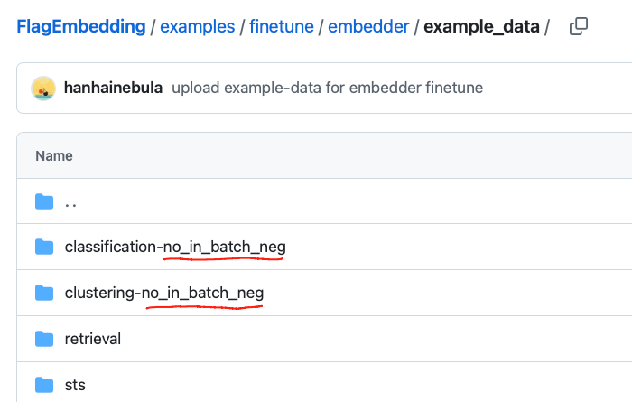

# MTEB 中的 Embedding 模型文本分类微调实践

本文使用 [MTEB (Massive Text Embedding Benchmark)](https://github.com/embeddings-benchmark/mteb) ，并分享了在该框架下进行 embedding 模型文本分类微调的思路。评估代码使用mteb包，embedding模型微调的代码使用 FlagEmbedding。

大家熟悉的文本分类微调流程，通常是基于 BERT 等预训练模型，在下游分类任务上添加分类头并进行端到端训练。而本文关注的则是另一种思路：对文本表示（embedding）模型本身进行微调，即优化其将文本映射为向量的能力。

在这种训练范式下，目标并不是让模型直接完成分类任务，而是让同一类别的文本在向量空间中彼此靠近，从而为后续的向量检索或 kNN 分类打下基础。简而言之，这是一次围绕“语义相似度学习”而非“标签预测”的微调过程。

文章按照下述三个部分展开：

1. 原始模型文本分类评估
2. 微调 embedding 模型
3. 微调后的模型评估

## 原始模型文本分类评估

在之前的一篇文章，介绍了如何使用 mteb 包，在自定义的数据集上评估embedding模型的效果：[1 MTEB：基于 Embedding 的文本分类评估与实战解析](https://jieshen.blog.csdn.net/article/details/148770985?spm=1001.2014.3001.5502)。

```python
import mteb
from mteb.abstasks.TaskMetadata import TaskMetadata
from mteb.abstasks.AbsTaskClassification import AbsTaskClassification
from typing_extensions import override

class AgNews(AbsTaskClassification):
    metadata = TaskMetadata(
        name="AgNews",
        description="AG is a collection of more than 1 million news articles.",
        dataset={
            "path": "fancyzhx/ag_news",
            "revision": "eb185aade064a813bc0b7f42de02595523103ca4",
        },
        type="Classification",
        category="s2s",
        modalities=["text"],  # text or image
        eval_splits=["test"],
        eval_langs=["eng-Latn"],
        main_score="accuracy",
        date=None,
        domains=None,
        task_subtypes=None,
        license=None,
        annotations_creators=None,
        dialect=None,
        sample_creation=None,
        bibtex_citation="""""",
    )
    # option
    samples_per_label: int = 16
```

```python
# model = mteb.get_model("BAAI/bge-m3")
raw_model = mteb.get_model("/Users/username/.cache/modelscope/hub/models/BAAI/bge-small-en-v1___5")

evaluation = mteb.MTEB(tasks=[AgNews(method="kNN-pytorch", n_experiments=8)])
raw_cls_res = evaluation.run(raw_model)
raw_cls_res[0].scores
```

原始模型的 accuracy_cosine 是 0.77847039。

评估方法选择 `kNN-pytorch` ，knn方法不需要在下游任务上再微调linear层，可更好地反应出embedding模型的质量。详情说明可查看参考资料1。
需要给 mteb.get_model 传入模型名。如果你使用huggingface模型名遇到了报错，有时候不是网络被屏蔽的原因，有时会是mteb 注册模型与任务的原因。可参考上述代码传入modelscope平台的本地绝对路径解决报错。

## Embedding 模型微调

此前，我写过一篇博客介绍过如何微调embedding模型，[微调Embedding模型：基于BERT的实战教程](https://jieshen.blog.csdn.net/article/details/147043668?spm=1011.2415.3001.5331)，此前的博客主要针对检索功能。在一个 batch 的数据计算中，通过矩阵乘法算出当前query与所有负样本的相似值。每个batch 数据里面 的多个query都不一样，故针对当前query而言，其他query对应的数据均可以算作负样本。
计算过程：形状为(batch_size, 1) 与 形状为(1, batch_size * group_size) 的两个矩阵做乘法。

而文本分类的embedding微调就不一样了，无法把batch里面其他query对应的样本直接当作负样本。只能使用当前query对应的负样本。batch_size 要设置为1。
计算过程：形状为(1, 1) 与 形状为(1, 1 * group_size) 的两个矩阵做乘法。按照这种矩阵计算方式，速度会显著降低。在微调过程中，确实也发现了微调速度降低的现象。这个矩阵进行可以有一个改进提高计算速度。
改进的计算过程：形状为(batch_size, 1, 1) 与 形状为(batch_size, 1, group_size) 的两个矩阵做乘法。通过三维矩阵的改进，依然也可以实现在一个batch数据的计算中，当前query只与当前query对应的样本做计算。
FlagEmbedding没有采取这种做法，我也懒得折腾这些，直接使用FlagEmbedding封装好的工具微调模型就行。

前面的理论介绍部分，若没有debug过代码，很抽象与难以理解。如果理解不了，建议跳过也行，这样可以省下不少的时间。

### FlagEmbedding框架学习

在这个地址 [https://github.com/FlagOpen/FlagEmbedding/tree/master/examples/finetune/embedder](https://github.com/FlagOpen/FlagEmbedding/tree/master/examples/finetune/embedder) 中，看到了很多embedding 微调的代码。

**same_dataset_within_batch**: All samples in the same batch comes from the same dataset.
重点关注`same_dataset_within_batch`参数，使用该参数后`per_device_train_batch_size`会自动变成1。

```shell
torchrun --nproc_per_node 2 \
	-m FlagEmbedding.finetune.embedder.encoder_only.m3 \
	--model_name_or_path BAAI/bge-m3 \
    --cache_dir ./cache/model \
    --train_data ./example_data/retrieval \
    			 ./example_data/sts/sts.jsonl \
    			 ./example_data/classification-no_in_batch_neg \
    			 ./example_data/clustering-no_in_batch_neg \
    --cache_path ./cache/data \
    --train_group_size 8 \
    --query_max_len 512 \
    --passage_max_len 512 \
    --pad_to_multiple_of 8 \
    --knowledge_distillation True \
    --same_dataset_within_batch True \
    --small_threshold 0 \
    --drop_threshold 0 \
    --output_dir ./test_encoder_only_m3_bge-m3_sd \
    --overwrite_output_dir \
    --learning_rate 1e-5 \
    --fp16 \
    --num_train_epochs 2 \
    --per_device_train_batch_size 2 \
    --dataloader_drop_last True \
    --warmup_ratio 0.1 \
    --gradient_checkpointing \
    --deepspeed ../ds_stage0.json \
    --logging_steps 1 \
    --save_steps 1000 \
    --negatives_cross_device \
    --temperature 0.02 \
    --sentence_pooling_method cls \
    --normalize_embeddings True \
    --kd_loss_type m3_kd_loss \
    --unified_finetuning True \
    --use_self_distill True \
    --fix_encoder False \
    --self_distill_start_step 0
```

上述是官方给出的微调embedding的代码，默认使用 torchrun。如果你只是想学会使用FlagEmbedding框架，使用上述脚本，多修改几次参数基本也就熟悉了。

为了方便大家debug代码，我提供了下述`embedding_ft.py`脚本的代码：

```python
from transformers import HfArgumentParser

from FlagEmbedding.finetune.embedder.encoder_only.base import (
    EncoderOnlyEmbedderDataArguments,
    EncoderOnlyEmbedderTrainingArguments,
    EncoderOnlyEmbedderModelArguments,
    EncoderOnlyEmbedderRunner,
)

parser = HfArgumentParser(
    (
        EncoderOnlyEmbedderModelArguments,
        EncoderOnlyEmbedderDataArguments,
        EncoderOnlyEmbedderTrainingArguments,
    )
)

base_args_d = {
    "model_name_or_path": "BAAI/bge-small-en-v1.5",
    # "train_data": [
    #     "./data/classification-no_in_batch_neg",
    # ],
    "cache_path": "./cache/data",
    "train_group_size": 8,
    "query_max_len": 64,
    "passage_max_len": 64,
    "pad_to_multiple_of": 8,
    "query_instruction_for_retrieval": "Represent this sentence for searching relevant passages: ",
    "query_instruction_format": "{}{}",
    "knowledge_distillation": False,
    # "output_dir": "./test_encoder_only_base_bge-small-en-v1.5",
    "overwrite_output_dir": True,
    "learning_rate": 1e-5,
    "num_train_epochs": 2,
    "per_device_train_batch_size": 3,
    "dataloader_drop_last": True,
    "warmup_ratio": 0.1,
    "logging_steps": 1,
    "save_steps": 500,
    "temperature": 0.02,
    "sentence_pooling_method": "cls",
    "normalize_embeddings": True,
    "kd_loss_type": "kl_div",
}


def get_runner(args_d):
    # model_args, data_args, training_args = parser.parse_args_into_dataclasses()
    model_args, data_args, training_args = parser.parse_dict(args_d)
    model_args: EncoderOnlyEmbedderModelArguments
    data_args: EncoderOnlyEmbedderDataArguments
    training_args: EncoderOnlyEmbedderTrainingArguments
    # 在 runner 查看 dataset 对象
    runner = EncoderOnlyEmbedderRunner(
        model_args=model_args, data_args=data_args, training_args=training_args
    )
    return runner
    # runner.run()


if __name__ == "__main__":
    # base_args_d["output_dir"] = "output/no_same_no_batch"
    base_args_d["same_dataset_within_batch"] = True
    base_args_d["train_group_size"] = 8
    base_args_d["train_data"] = [
        "./data/classification",
    ]
    # base_args_d["train_data"] = [
    #     "./data/classification-no_in_batch_neg",
    # ]
    base_args_d["output_dir"] = "output/same"
    ruuner = get_runner(base_args_d)
    ruuner.run()
```

通过 `train_data`参数指定数据集，可参考 [该文件夹](https://github.com/FlagOpen/FlagEmbedding/tree/master/examples/finetune/embedder/example_data) 下的json格式文本，针对不同的任务，设置完成不同格式的数据集转换。

下述是文本分类的数据集模版格式：

```python
{
    "query": "I ordered my card but it still isn't here",
    "pos": ["When will my card arrive?"],
    "neg": [
        "How do I change my PIN?",
        "How do I cancel a transfer?",
				...
        "Why was my transfer declined?",
        "How do I activate my card?",
    ],
    "prompt": "",
    "type": "symmetric_class",
}
```

【注意】：
    num_train_epochs 与 per_device_train_batch_size 参数的设置要大于1，不然会报错。

如果你运行 `embedding_ft.py` 不出意外的话，会报错。因为FlagEmbedding使用分布式运行代码，故直接运行 py脚本，会报错。你可以参考我的这个[PR](https://github.com/FlagOpen/FlagEmbedding/pull/1478)代码，解决这个问题。简而言之就是跳过报错的 if 判断就可以了。

### 模式对比

在 [https://github.com/FlagOpen/FlagEmbedding/tree/master/examples/finetune/embedder/example_data](https://github.com/FlagOpen/FlagEmbedding/tree/master/examples/finetune/embedder/example_data) 文件夹下，可以看到不同任务的数据集文件夹。



FlagEmbedding 通过文件夹的方式加载数据集，观察上图可以发现，分类与聚类的文件夹名字都是以 `no_in_batch_neg` 结尾。
代码会自动判断文件夹是否以no_in_batch_neg_flag结尾，若是，no_in_batch_neg_flag为True，否则为False。从而加载不同的损失计算代码。

```python
if no_in_batch_neg_flag:
    compute_loss_func = self._compute_no_in_batch_neg_loss
else:
    if self.negatives_cross_device:
        compute_loss_func = self._compute_cross_device_neg_loss
    else:
        compute_loss_func = self._compute_in_batch_neg_loss
```

通过 `output_dir` 参数指定输出文件夹

## 微调模型评估

- same_dataset_within_batch 为True 还是 False
- 文件夹是否以no_in_batch_neg_flag结尾


```python
results = {}
for sub_fold in os.listdir("output"):
    model_dir = os.path.join("output", sub_fold)
    ft_model = mteb.get_model(model_dir)
    evaluation = mteb.MTEB(tasks=[AgNews(method="kNN-pytorch", n_experiments=8)])
    results[sub_fold] = evaluation.run(ft_model)

for k, item in results.items():
    print(k, item[0].scores["test"][0]["accuracy_cosine"])
```

输出：

```python
same_no_in_batch_neg 0.8141611842105263
no_same_no_in_batch_neg 0.7237499999999999
no_same 0.7237499999999999
same 0.8141776315789473
```

- same_no_in_batch_neg：same_dataset_within_batch 为True，文件夹以 no_in_batch_neg 结尾。
- no_same：same_dataset_within_batch 为False，文件夹不以 no_in_batch_neg 结尾。

原始模型做文本分类accuracy_cosine的值是0.7784。通过评估结果发现 no_same 开头的评估结果，文本分类的精度不增反降。而以same开头的评估结果，文本分类的精度均得到了上升。这说明文本分类的 embedding 微调需要设置 same_dataset_within_batch 为True。

文件是否以no_in_batch_neg_flag结尾，则对模型微调的结果影响不大。同时same_dataset_within_batch 设置True会导致模型微调速度变慢。

## 参考资料

1. [MTEB：基于 Embedding 的文本分类评估与实战解析](https://jieshen.blog.csdn.net/article/details/148770985?spm=1001.2014.3001.5502)
2. [微调Embedding模型：基于BERT的实战教程](https://jieshen.blog.csdn.net/article/details/147043668?spm=1011.2415.3001.5331)

## 额外思考

1. mteb的评估，embedding使用的是cls还是mean？

   在前文[embedding模型的两种编码方式（cls和mean）及其实现细节](https://jieshen.blog.csdn.net/article/details/148642479?spm=1011.2415.3001.5331) 介绍了 embedding 模型的两种计算方式。
   在使用 MTEB 进行评估时，embedding 的计算方式（例如使用 `cls` token 或 `mean pooling`）**并不是由 `MTEB` 决定的**，而是由你传入的 `model` 决定的。
   对于 BAAI 的 BGE 系列模型，默认是使用 **`CLS pooling`**。
   FlagEmbedding包，可以选择 cls 还是 mean。

2. 文件是否以no_in_batch_neg_flag结尾，为什么对模型微调的结果影响不大？
   根据 no_in_batch_neg_flag 选择不同的损失计算函数。

   same_dataset_within_batch设置为True时，会调用AbsEmbedderSameDatasetTrainDataset数据集，就自动把training_args.per_device_train_batch_size 设置 1。虽然no_in_batch_neg_flag不同会调用不同的损失函数，但在batch_size为1的时候，损失计算函数计算值变成一样。

   

   
