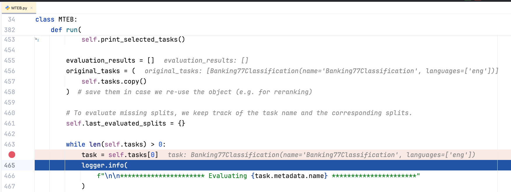
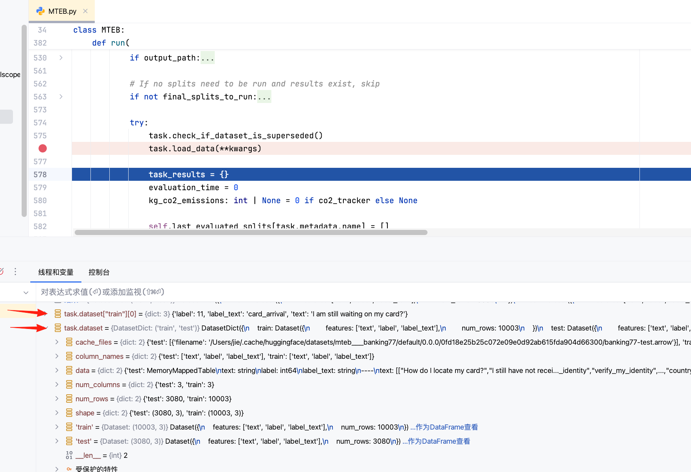
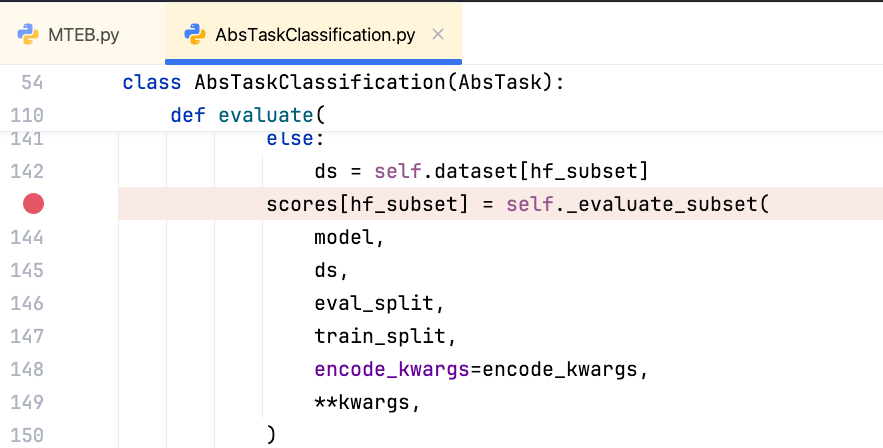
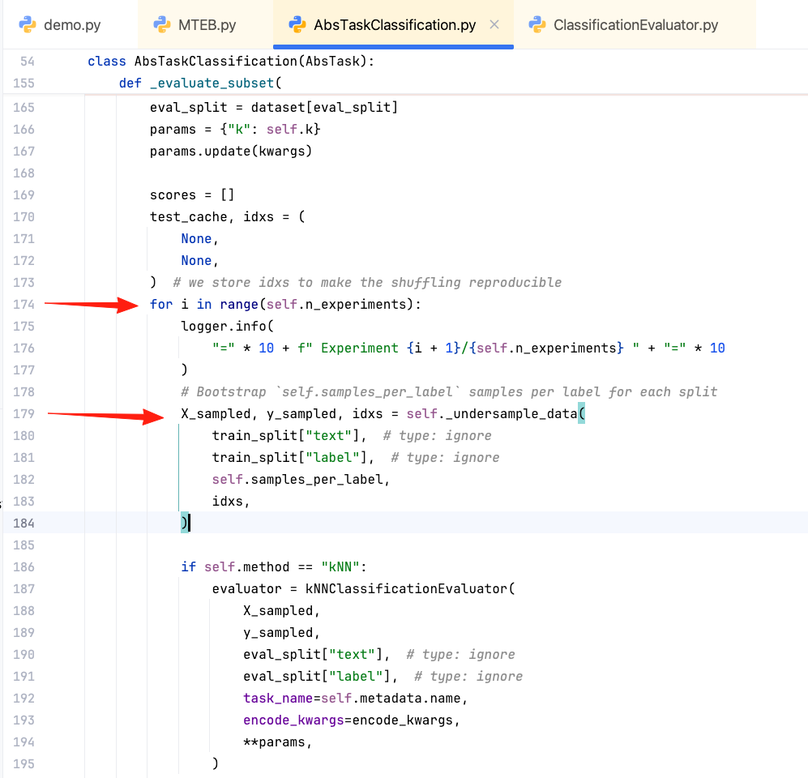
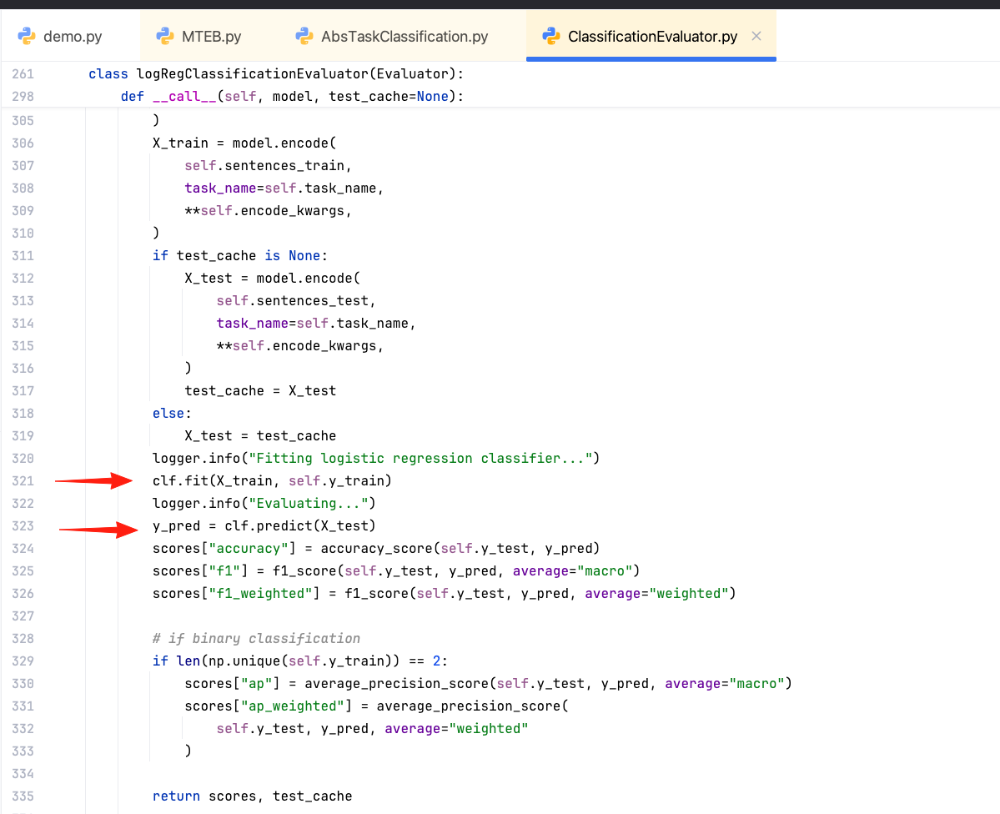
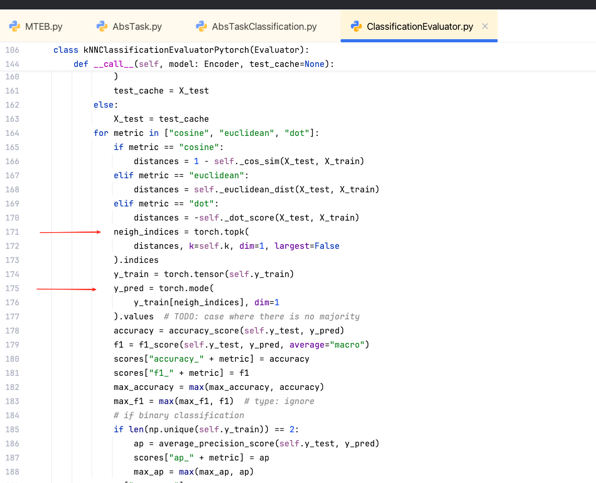

# MTEB：基于 Embedding 的文本分类评估与实战解析


最近在做对比学习、embedding模型这一块。发现在 [MTEB, Massive Text Embedding Benchmark](https://github.com/embeddings-benchmark/mteb) 中，有文本分类的评估。便想着学习一下MTEB的代码如何使用embedding做文本分类的评估。

如果想写论文的话，对比学习微调embedding模型 + 文本分类下游任务微调，也可以做一下。


## MTEB 分类评估实现

代码参考自：https://github.com/embeddings-benchmark/mteb

```python
from modelscope import snapshot_download
import mteb
from sentence_transformers import SentenceTransformer

# model_dir = snapshot_download("BAAI/bge-m3")
model_dir = snapshot_download("AI-ModelScope/bert-base-uncased")

# Define the sentence-transformers model name
# model_name = "average_word_embeddings_komninos"
model = mteb.get_model(
    model_dir
)  # if the model is not implemented in MTEB it will be eq. to SentenceTransformer(model_name)

tasks = mteb.get_tasks(tasks=["Banking77Classification"])
evaluation = mteb.MTEB(tasks=tasks)
results = evaluation.run(model, output_folder=f"results/bert-base-uncased")
```

使用原始的 BERT 模型，目前的embedding模型一般都是基于BERT模型微调而来，实验使用原始的BERT模型，可以看到更明显的效果。

在输出文件夹结果中，可以看到BERT模型在`Banking77Classification` 这个文本分类任务上的评估结果：

```
"accuracy": 0.634675,
"f1": 0.632871,
"f1_weighted": 0.632871
```

把embedding模型换成 `bge-m3`，观察使用了更好的 embedding 模型，效果是否有明显的提升：

```
"accuracy": 0.819318,
"f1": 0.810852,
"f1_weighted": 0.810852,
```

使用 `bge-m3` embedding 模型后，发现各项评估指标有了明显的提升，从 0.63 提升到 0.81。


## debug 流程

不知道大家有没有好奇，为什么 embedding 模型可以做文本分类？

我 debug 了 MTEB的代码，发现这个流程与BERT模型做文本分类的流程一样，针对每个文本的tensor，做逻辑回归微调。MTEB的评估也需要训练集，用于训练模型，然后再做文本分类的预测。

MTEB的代码也支持KNN方法做文本分类，针对当前样本与训练集的样本计算相似度，拿到TopK个最相似的样本。预测的类别结果是：其与训练集中最相似的文本所属的类别。

debug MTEB文本分类流程，简要概述一下：
当前mteb的版本：[https://github.com/embeddings-benchmark/mteb/tree/dcdc16a74ba88ade48f734c3dbb8b634dd28439c](https://github.com/embeddings-benchmark/mteb/tree/dcdc16a74ba88ade48f734c3dbb8b634dd28439c)

*在做debug的时候，抓大放小，只关注核心的代码逻辑部分，一些无关的代码不要太关注，因为咱们的时间与精力都是有限的！*

在 MTEB.py 脚本 run方法，task 获取当前做文本分类的任务




**加载数据集** 

通过 `task.load_data` 加载数据集



在底部的监视窗中，通过对表达式求值可以查看到 task 加载完成的文本分类数据集的详情。


接着调用 `self._run_eval` 进入评估部分的代码。在 `scores[hf_subset] = self._evaluate_subset` 再打一个断点，在这里会完成评估的计算。




**投票与下采样**




`n_experiments` 是要重复实验的次数（投票）。


下采样：

```python
  def _undersample_data(self, X, y, samples_per_label: int, idxs=None):
      """Undersample data to have samples_per_label samples of each label"""
      X_sampled = []
      y_sampled = []
      if idxs is None:
          idxs = np.arange(len(y))
      np.random.shuffle(idxs)
      label_counter = defaultdict(int)
      for i in idxs:
          if label_counter[y[i]] < samples_per_label:
              X_sampled.append(X[i])
              y_sampled.append(y[i])
              label_counter[y[i]] += 1
      return X_sampled, y_sampled, idxs
```

该数据集有 77 个类别，类别的分布不均衡。为了减轻类别分布不均衡对分类结果的影响，使用下采样针对每个类别都选取最多不超过 samples_per_label个样本，该例子默认为8。多次下采样，完成多次评估实验，在最后对实验结果取均值。


**逻辑回归**

该任务默认的方法是 logReg 逻辑回归。



通过 sklearn 做一个逻辑回归的训练与预测就结束了。

发现其支持 KNN与逻辑回归，通过method 选择不同的方法。

在这里有一个重复实验取平均，相当于一个投票，还有一个下采样。维持类别均衡。


## KNN 方法评估

在前面debug代码时候，发现评估方法支持KNN，便想尝试一下KNN的方法。

```python
from modelscope import snapshot_download
import mteb
from sentence_transformers import SentenceTransformer

model_dir = snapshot_download("BAAI/bge-m3")

# if the model is not implemented in MTEB it will be eq. to SentenceTransformer(model_name)
model = mteb.get_model(model_dir)

tasks = mteb.get_tasks(tasks=["Banking77Classification"])
tasks[0].method = "kNN-pytorch"
evaluation = mteb.MTEB(tasks=tasks)
results = evaluation.run(model, output_folder=f"results/bge-m3")
print(results)
```

method为task的属性，无法通过 get_tasks 传参。于是便在task创建完成后，再修改method。

tasks 是 tuple 类型，通过下标获取到其中的 task，修改 task 的 method `tasks[0].method = "kNN-pytorch"` 。


kNN-pytorch的文本分类结果：

```python
"accuracy_cosine": 0.800909,
"f1_cosine": 0.799799,
"accuracy_euclidean": 0.800909,
"f1_euclidean": 0.799799,
"accuracy_dot": 0.800909,
"f1_dot": 0.799799,
"accuracy": 0.800909,
"f1": 0.799799,
```

KNN的效果低于逻辑回归约2%的精度，KNN的结果低于逻辑回归在预料之中。KNN只是基于空间距离，效果不如逻辑回归训练模型。

评估的过程：测试集embedding与训练集embedding做矩阵乘法，得到测试集的文本与训练集文本的相似度。通过 torch.topK找到在训练集中最相近的几个样本，再通过toch.mode 计算众数，就可预测出类别。




## 自定义数据集文本分类评估

官方代码给出了加载默认注册的文本分类数据集的代码实现，在下述的例子中，展示如何加载 huggingface平台和本地的数据集完成文本分类的评估。


自定义task的相关文档：

- [mteb adding_a_dataset ](https://github.com/embeddings-benchmark/mteb/blob/main/docs/adding_a_dataset.md)
- [mteb Using a Custom Task](https://github.com/embeddings-benchmark/mteb/blob/dcdc16a74ba88ade48f734c3dbb8b634dd28439c/docs/usage/usage.md#using-a-custom-task)
- [FlagEmbedding C_MTEB Classification.py](https://github.com/FlagOpen/FlagEmbedding/blob/875fd4ffcb894313a918e8bb0c9b7ead82f37e64/research/C_MTEB/C_MTEB/tasks/Classification.py) 这里提供了很多自定义的文本分类task


以 huggingface 平台的`fancyzhx/ag_news` 数据集，完成自定义数据集的分类评估实验。


```python
from mteb.abstasks.TaskMetadata import TaskMetadata
from mteb.abstasks.AbsTaskClassification import AbsTaskClassification
from typing_extensions import override


class AgNews(AbsTaskClassification):
    metadata = TaskMetadata(
        name="AgNews",
        description="AG is a collection of more than 1 million news articles. ",
        dataset={
            "path": "fancyzhx/ag_news",
            "revision": "eb185aade064a813bc0b7f42de02595523103ca4"
        },
        type="Classification",
        category="s2s",
        modalities=["text"],  # text or image
        eval_splits=["test"],
        eval_langs=["eng-Latn"],
        main_score="accuracy",
        date=None,
        domains=None,
        task_subtypes=None,
        license=None,
        annotations_creators=None,
        dialect=None,
        sample_creation=None,
        bibtex_citation="""""",
    )
    # option
    samples_per_label: int = 16


class AgNewsLocal(AbsTaskClassification):
    metadata = TaskMetadata(
        name="PersonGender",
        description="Gender classification by name",
        dataset={
            "path": "csv",
            "data_files": {"train": "person_train.csv", "test": "person_test.csv"},
            "revision": "None"
        },
        type="Classification",
        category="s2s",
        modalities=["text"],  # text or image
        eval_splits=["test"],
        eval_langs=["cmn-Hans"],
        main_score="accuracy",
        date=None,
        domains=None,
        task_subtypes=None,
        license=None,
        annotations_creators=None,
        dialect=None,
        sample_creation=None,
        bibtex_citation="""""",
    )
    # option
    samples_per_label: int = 16

    @override
    def dataset_transform(self):
        self.dataset = self.dataset.rename_column("name", "text")
        self.dataset = self.dataset.rename_column("gender", "label")


if __name__ == "__main__":
    import mteb

    model = mteb.get_model("BAAI/bge-m3")
    evaluation = mteb.MTEB(
        tasks=[
            AgNews(method="kNN-pytorch", n_experiments=8),
            # AgNewsLocal(method="kNN-pytorch", n_experiments=8),
            AgNewsLocal(n_experiments=8),
        ])
    evaluation.run(model)

```

AgNews 使用hugginface平台的数据集，AgNewsLocal 使用本地的csv文件作为数据集。TaskMetadata的dataset参数通过datasets.load_dataset加载数据集。自定义数据集的revision必须填写为字符串类似，随便填写一个字符串也没问题，在这里仅仅只是在结果中，区分数据集的版本号，没有大的影响。

在`dataset_transform`中对数据集进行处理，比如有的数据集没清洗好，可在这里清洗。


**参数修改**：

- 创建子类`AbsTaskClassification`修改默认的参数，比如：在子类中定义`samples_per_label`为16。
- `__init__`在task初始化的时候传参，比如： `AgNews(method="kNN-pytorch", n_experiments=8)`
- 在task创建之后再通过属性值修改参数，比如：`task.method="kNN-pytorch"` 等方式修改参数


下一篇：在文本分类任务上微调 embedding，敬请期待！

## 参考资料

-  [MTEB, Massive Text Embedding Benchmark](https://github.com/embeddings-benchmark/mteb) 
- [FlagEmbedding](https://github.com/FlagOpen/FlagEmbedding/tree/master) 其中包含 C- MTEB