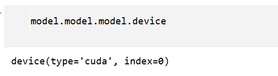
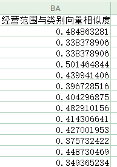

# 企业信息表两个属性列计算相似度

## bge-m3 官方例子

下述是官方的一个例子，点击查看 [https://modelscope.cn/models/BAAI/bge-m3](https://modelscope.cn/models/BAAI/bge-m3)：

```python
from FlagEmbedding import BGEM3FlagModel

model = BGEM3FlagModel('BAAI/bge-m3',  
                       use_fp16=True) # Setting use_fp16 to True speeds up computation with a slight performance degradation

sentences_1 = ["What is BGE M3?", "Defination of BM25"]
sentences_2 = ["BGE M3 is an embedding model supporting dense retrieval, lexical matching and multi-vector interaction.", 
               "BM25 is a bag-of-words retrieval function that ranks a set of documents based on the query terms appearing in each document"]

embeddings_1 = model.encode(sentences_1,
                            batch_size=12, 
                            max_length=8192, # If you don't need such a long length, you can set a smaller value to speed up the encoding process.
                            )['dense_vecs']
embeddings_2 = model.encode(sentences_2)['dense_vecs']
similarity = embeddings_1 @ embeddings_2.T
print(similarity)
# [[0.6265, 0.3477], [0.3499, 0.678 ]]
```

文本tokenizer化与模型encode都封装在FlagEmbedding里面了。这样只需要传入字符串，不需要考虑字符串有序分块与tokenizer的padding等相关操作。这样简化了大家的工作。

`sentences_1` 与 `sentences_2` 传入的都是一维字符串列表。

embeddings_1与embeddings_2的向量shape都是 (2, 1024)。embeddings_1 @ embeddings_2.T 得到的shape是(2, 2)。

embeddings_1与embeddings_2 都被转移到cpu上了，返回的是numpy格式的数据。通过下述代码`model.model.model.device`可以查看模型在哪个设备上。虽然最后的embedding的乘法计算在CPU上，没有使用GPU，但是我发现CPU做这个矩阵运算的速度也很快，对比GPU几乎没有明显的速度区别。




如果你使用 `BAAI/bge-m3` 报错，因为hugggingface服务器在国外，你可以使用modelscope平台下载模型。

## 简洁实现
针对企业表的两列文本，粗略地评估一下这两列文本的相似度。首先把两列文本转成向量，再计算这个向量之间的相似度。

| 产业分类名称         | 经营范围                                                     |
| -------------------- | ------------------------------------------------------------ |
| 现代中药与民族药制造 | 药材、绒毛、果品收购、三轮运输。(以上经营范围涉及许可经营项目的，应在取得有关部门的许可后方可经营) |
| 现代中药与民族药制造 | 中药材种栽.技术指导培训.药用动物饲养技术指导.中药材.         |
| 现代中药与民族药制造 | 中药材种植，受委托经营中药材种子、种苗。                     |
| 现代中药与民族药制造 | 国家允许研究、培育、种植的中药材；生产销售优良林果、蔬菜、花卉、林园绿化及国家允许开发生产销售的林副产品；中药材及林果业种植技术咨询服务；三类中药材的购销(国家禁止和限制的除外)。(依法须经批准的项目，经相关部门批准后方可开展经营活动) |
| 现代中药与民族药制造 | 葛根种植加工工销售                                           |
| 现代中药与民族药制造 | 中药材种植兼营                                               |

代码的实现逻辑，基本可以参考上述 [bge-m3 官方例子](#bge-m3 官方例子)。但有一点不同的是，上述得到的相似度矩阵结果是(2, 2)的矩阵。这里的产业相似度计算，期待的相似度矩阵结果显然应该是一个(2, 1)的矩阵。如果你能很快的反应过来，应该怎么处理这里矩阵的shape，那么你的矩阵计算，理解还是深刻的。若理解存在难度，推荐看看我的这篇博客：[torch 高维矩阵乘法分析，一文说透](https://jieshen.blog.csdn.net/article/details/148635872?spm=1001.2014.3001.5502)。

只需要对 embeddings_1与 embeddings_2 做一个矩阵的形状变化即可。
embeddings_1与embeddings_2的向量shape都改成 (2, 1, 1024)。这样embeddings_1 @ embeddings_2.T 得到向量相似矩阵的shape是(2, 1, 1)。


```python
import os
import pandas as pd
import numpy as np
from tqdm import tqdm
from FlagEmbedding import BGEM3FlagModel

print("load BAAI/bge-m3 ...")
# Setting use_fp16 to True speeds up computation with a slight performance degradation
model = BGEM3FlagModel(
    "BAAI/bge-m3", 
    use_fp16=True,
)

def encode_df(df, output_file):
    embeddings_1 = model.encode(
        df["经营范围"].apply(lambda x: x if isinstance(x, str) else "").to_list(),
        batch_size=64,
        max_length=512,
        )

    embeddings_2 = model.encode(
        df["产业分类名称"].apply(lambda x: x if isinstance(x, str) else "").to_list(),
        batch_size=64,
        max_length=512,
        )
    t1 = embeddings_1['dense_vecs']
    t2 = embeddings_2['dense_vecs']
    t1 = t1[:, np.newaxis, :]
    t2 = t2[:, :, np.newaxis]
    scores = t1 @ t2
    scores = scores.flatten().tolist()
    df["经营范围与类别向量相似度"] = scores
    df.to_csv(output_file, index=False)

if __name__ == "__main__":
    raw_data_dir = r"原始文件夹"
    output_dir = r"目标文件夹"
    
    for sub_fold in os.listdir(raw_data_dir):
        p = os.path.join(raw_data_dir, sub_fold)
        for name in tqdm(os.listdir(p)):
            file_name = os.path.join(p, name)
            df = pd.read_csv(file_name, low_memory=False)
            output_sub_dir = os.path.join(output_dir, sub_fold)
            os.makedirs(output_sub_dir, exist_ok=True)
            output_file = os.path.join(output_sub_dir, name)
            encode_df(df, output_file)
```


## 从零开始pytorch实现

前面使用封装好 FlagEmbedding 工具包。直接就完成了推理，大家不容易了解底层的计算。
正好我也打算写一写、练练手。

```python
import os
import pandas as pd
from tqdm import tqdm
from transformers import AutoTokenizer, AutoModel
import torch
import torch.nn.functional as F
from torch.utils.data import DataLoader, Dataset

# 1. 准备
tokenizer = AutoTokenizer.from_pretrained("BAAI/bge-m3")
model = (
    AutoModel.from_pretrained("BAAI/bge-m3", torch_dtype=torch.float16).cuda().eval()
)


class PairDataset(Dataset):
    def __init__(self, df):
        self.A = (
            df["经营范围"].apply(lambda x: x if isinstance(x, str) else "").to_list()
        )
        self.B = (
            df["战略性新兴产业分类名称"]
            .apply(lambda x: x if isinstance(x, str) else "")
            .to_list()
        )

    def __len__(self):
        return len(self.A)

    def __getitem__(self, idx):
        return self.A[idx], self.B[idx]


def collate_fn(batch):
    text1s, text2s = zip(*batch)
    enc_A = tokenizer(
        list(text1s), padding=True, truncation=True, max_length=256, return_tensors="pt"
    )
    enc_B = tokenizer(
        list(text2s), padding=True, truncation=True, max_length=256, return_tensors="pt"
    )
    return enc_A, enc_B

# tokenizer 放在 collate_fn 里面，使用 max_workers 反而是增加了进程加载与切换的负担
# 尽量让 collate_fn 尽可能轻量（避免计算、日志），故在该脚本中不设置 max_workers

def safe_num_workers(dataset_len, max_workers=4):
    return 0 if dataset_len <= 10000 else max_workers

def run(df, output_file):
    # 2. DataLoader
    dataset = PairDataset(df)
    loader = DataLoader(
        dataset,
        batch_size=64,
        # num_workers=safe_num_workers(len(dataset)),
        pin_memory=True,
        collate_fn=collate_fn,
        shuffle=False,
    )

    results = []
    for enc_A, enc_B in tqdm(loader):
        # 3. GPU 推理
        for t in (enc_A, enc_B):
            for k, v in t.items():
                t[k] = v.to("cuda", non_blocking=True)
        with torch.no_grad():
            emb_A = model(**enc_A).last_hidden_state[:, 0]
            emb_B = model(**enc_B).last_hidden_state[:, 0]

            emb_A = F.normalize(emb_A, dim=1)
            emb_B = F.normalize(emb_B, dim=1)

        emb_A = emb_A.unsqueeze(1)
        emb_B = emb_B.unsqueeze(1)

        sims = emb_A @ emb_B.transpose(-2, -1)
        sims = sims.flatten().cpu().tolist()
        results.extend(sims)

    # 5. 把 results 写回原表
    df["sim"] = results
    df.to_csv(output_file, index=False)


if __name__ == "__main__":
    raw_data_dir = r"C:\Users\1\Desktop\cache\战新企业demo"
    output_dir = r"C:\Users\1\Desktop\cache\new_vec_similar_industry"

    for sub_fold in os.listdir(raw_data_dir):
        p = os.path.join(raw_data_dir, sub_fold)
        for name in os.listdir(p):
            file_name = os.path.join(p, name)
            df = pd.read_csv(file_name, low_memory=False)
            output_sub_dir = os.path.join(output_dir, sub_fold)
            os.makedirs(output_sub_dir, exist_ok=True)
            output_file = os.path.join(output_sub_dir, name)
            run(df, output_file)

```


BGE 系列的embedding模型默认使用 cls token 对应的tensor作为encode的结果。
上述从零开始的实现，我验证过了与上述FlagEmbedding包计算的结果一致。

得到的结果如下图所示，在表格右侧添加了一个属性列：




## 开源
地址：[https://github.com/JieShenAI/csdn/tree/main/25/07/embedding_infer](https://github.com/JieShenAI/csdn/tree/main/25/07/embedding_infer)

- vector_smilority.py: FlagEmbedding包完成计算
- scratch.py: 从零开始实现

两个脚本得到的计算结果是一样的