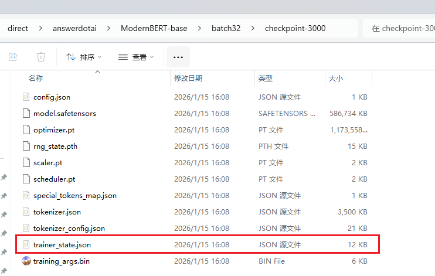

# BERT_Experiment_Template

## 背景

最近在做大模型蒸馏到BERT模型的实验，一个层次分类任务。需要在很多不同的模型结构与不同的数据集上验证我设计的模型结构的有效性。在改变模型架构的过程中，经常发现在某一个数据集上效果好，在大量数据集上测试后发现又不好。验证集上效果好，测试集上效果又不好。（被折磨累了，不同的模型，训练的时候从huggingface加载，模型参数保存到本地，评估的时候再从本地加载模型）。

为了减少人工操作与修改代码的精力与时间，我编写了下述BERT实验的模板。

## 便捷使用

### 训练脚本

`scripts/batch_train.sh`

```python
bash train.sh fancyzhx/ag_news BAAI/bge-small-en-v1.5 32
bash train.sh fancyzhx/ag_news BAAI/bge-base-en-v1.5 32
bash train.sh fancyzhx/ag_news answerdotai/ModernBERT-base 32
```

给 train.sh 脚本传入不同的数据集名和模型名，就可以开始训练，操作便捷。

### 评估脚本

`scripts/batch_eval.sh`

```python
bash eval.sh fancyzhx/ag_news BAAI/bge-small-en-v1.5 32 /home/jie/github/demos/scripts/output/fancyzhx/ag_news/direct/BAAI/bge-small-en-v1.5/batch32/best_model

bash eval_test.sh fancyzhx/ag_news BAAI/bge-small-en-v1.5 32 /home/jie/github/demos/scripts/output/fancyzhx/ag_news/direct/BAAI/bge-small-en-v1.5/batch32/best_model
```

`eval.sh` 用于验证集的评估。`eval_test.sh`用于测试集的评估。

通过这种方式编写完整的训练与评估的脚本，减少人工参与的工作量。

## 通用化的模型加载与保存

阅读下述文章 [如何使用 AutoModel 保存与加载自定义模型.https://zhuanlan.zhihu.com/p/1992719457647363653](https://zhuanlan.zhihu.com/p/1992719457647363653) ， 你会知道不同变体的模型的Config和Model类均需要修改，而且加载参数的时候保存在本地的参数与变量名是对应的。BERT类的模型是`self.bert`变量。若你要做一般化的模型加载，取名为`self.model`然后加载模型参数，会发现大量的模型参数都加载不进来。这是因为保存在本地的参数与变量名是对应的。不同架构的模型其变量名字又不一样，难以做到一般化。

大家接触到BERT的时候，一般都用 AutoModel 加载模型，训练与保存参数都很方便。但若我们在BERT模型的基础之上，再加很多变体网络层，那我们新添加的这些层的参数，就需要思考怎么保存到本地了。而且我们保存到本地的模型参数，难以通过AutoModel导入，因为我们定义了新的网络层，新的网络结构没有在transformer注册。

**一般化模型加载与参数保存的思路**：

下述是我编写的自定义模型，为了能够加载各种模型，在自定义模型的内部使用 `AutoModel.from_pretrained` 加载各种模型。

```python
import torch
from torch import nn
from transformers import PreTrainedModel, PretrainedConfig, AutoModel


class DiyConfig(PretrainedConfig):
    def __init__(self, hf_name=None, num_label=-1, **kwargs):
        super().__init__(**kwargs)
        self.num_label = num_label
        self.hf_name = hf_name


class DiyModel(PreTrainedModel):
    config_class = DiyConfig

    def __init__(self, config):
        super().__init__(config)
        print("custom config")
        print(config)
        self.model = AutoModel.from_pretrained(config.hf_name)
        print(self.model.config)

        self.hidden_size: int = self.model.config.hidden_size
        self.config = config
        self.layer_norm = nn.LayerNorm(self.hidden_size)
        self.block = nn.Sequential(
            nn.Dropout(p=0.1),
            nn.Linear(self.hidden_size, self.hidden_size),
            nn.GELU(),
            nn.Linear(self.hidden_size, self.hidden_size),
        )
        self.linear = nn.Linear(self.hidden_size, config.num_label)
        self.ce_loss = nn.CrossEntropyLoss()

    def forward(self, text_tokens, labels=None):
        output = self.model(**text_tokens)
        cls_tensor = output.last_hidden_state[:, 0]
        logits = cls_tensor + self.block(self.layer_norm(cls_tensor))
        logits = self.linear(logits)
        if labels is not None:
            return {
                "logits": logits,
                "loss": self.ce_loss(logits, labels),
            }
        return {
            "logits": logits
        }
```


在`TrainerUtil` 根据是训练还是评估，实现加载 huggingface 平台的权重，还是加载本地的模型。

```python
    def set_model(self):
        if self.training_args.do_train:
            assert self.model_class is None, "loading custom model, no need for model_class."
            diy_config = DiyConfig(
                hf_name=self.model_args.model_name_or_path,
                num_label=self.data_args.num_label
            )
            self.model = DiyModel(diy_config)
        else:
            # 评估的时候，加载本地模型
            self.model = DiyModel.from_pretrained(self.model_args.model_name_or_path)
```

训练完成后，保存到本地 config 文件：

```json
{
  "architectures": [
    "DiyModel"
  ],
  "dtype": "float32",
  "hf_name": "answerdotai/ModernBERT-base",
  "num_label": 4,
  "transformers_version": "4.57.5"
}
```

保存到本地的 config 其中的数据，就是在 `DiyConfig` 定义的属性。大家不用纠结 BERT config 没有保存到本地，BERT的config每次都会从huggingface加载，本地不用保存。

### 缺点

在浏览  [如何使用 AutoModel 保存与加载自定义模型.https://zhuanlan.zhihu.com/p/1992719457647363653](https://zhuanlan.zhihu.com/p/1992719457647363653)  文章后，会发现 `__init__` 里面一般都只搭建模型结构，不做模型的初始化。我上述的代码， 在 `__init__` 里面使用 AutoModel 加载模型，**存在模型权重重复加载的问题**。

具体来说，当使用  `DiyModel.from_pretrained`  加载经过训练后的本地模型权重时:

1. from_pretrained 会调用 `__init__` ，然后就从 AutoModel 加载 huggingface 的模型权重；
2. 再次自动加载本地的模型权重。

多了一次加载 huggingface权重的过程，这是一次多余的参数加载。我是为了保持代码的通用化，才不得不在 `__init__`使用AutoModel加载模型。（若你有更好的处理方法，欢迎 github 提交PR，或者写在评论区）

## 通用数据集加载

不同数据集的字段不一致，统一数据集格式，保存到本地。

继承 `TrainerUtil` 加载本地数据集，重写`set_dataset`方法。

```python
    def set_dataset(self):
        """
        若数据集加载的方式不一样，需要重写该函数
        :return:
        """
        self.train_dataset = self.dataset_class(args=self.data_args, dataset_file="train.parquet")
        self.eval_dataset = self.dataset_class(args=self.data_args, dataset_file="validate.parquet")
        self.test_dataset = self.dataset_class(args=self.data_args, dataset_file="test.parquet")
```


## Tips

1. 如何判断模型从本地成功加载？

   

   训练模型的时候，通过下述参数，把验证集上f1最大的 checkpoint 作为 best_model 保存为最终的模型。

   ```shell
     --load_best_model_at_end=True \
     --metric_for_best_model=f1 \
   ```

   使用 `bash eval.sh` 对验证集进行评估，评估得到的指标，应该与`trainer_state.json` 文件 f1 效果最好的指标保持一致。

   

   ```json
       {
         "epoch": 1.0,
         "eval_accuracy": 0.94675,
         "eval_f1": 0.946754864465257,
         "eval_loss": 0.15842150151729584,
         "eval_precision": 0.9471439723240178,
         "eval_recall": 0.94675,
         "eval_runtime": 9.2457,
         "eval_samples_per_second": 2595.79,
         "eval_steps_per_second": 81.118,
         "step": 3000
       }
   ```

   